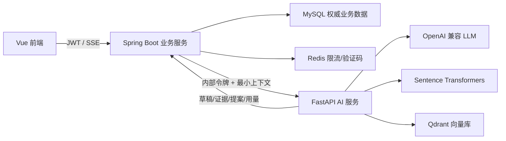

# 知序 Python AI 服务详细需求规格说明书

> 服务名称：`adaptive-learning-ai-service`  
> 适用项目：基于 AI Agent 的自适应个人学习管理系统  
> 文档版本：V1.2  
> 编写日期：2026-07-23  
> 本轮实施范围：P0 + 画像驱动目标推荐（模型网关、画像访谈、结构化目标候选、Embedding/Qdrant、RAG 问答、Java 集成与完整测试）

## 1. 文档目的

本文定义独立 Python AI 服务的职责、接口、数据契约、安全边界、向量检索、流式协议、失败降级、部署方式和验收标准。后续实现必须以本文为准；若实现与本文冲突，应先更新本文和变更记录，再修改代码。

核心架构原则：

> Java 负责确定性业务，Python 负责非确定性 AI。Python 可以生成草稿、证据、解释和提案，但不能绕过 Java 鉴权、用户确认和事务规则修改正式业务数据。

当前 AI 学习资料边界聚焦文档型内容。Python 只处理 Java 已解析并授权的文本 Chunk，用于 Embedding、检索和有据问答；视频、音频、直播和不可抽取文本的材料不进入 P0 学习进度、掌握度和报告统计。

## 2. 背景与问题

在本轮 Python 服务拆分之前，Java 后端已经实现 OpenAI Chat Completions 兼容调用、画像 SSE 流式输出、规则降级、本地哈希向量和 RAG 引用校验。该旧实现可以运行，但存在以下演进限制，因此当前主链路已经迁移到 Python：

1. Python 生态中的 Embedding、Reranker、Agent 编排、离线评测和模型实验工具接入成本更低；
2. 当前 `LOCAL_HASHED_128` 只表示词项哈希相似度，不是真正的语义 Embedding；
3. 当前向量以 JSON 存在 MySQL，检索时在 Java 内存全量评分，数据规模增大后延迟和内存占用不可控；
4. 画像 Prompt、RAG Prompt、供应商适配和流式解析与业务服务耦合；
5. 后续计划 Agent 需要持久化状态、人机确认、重试、评测和可观测性，适合由 Python AI 层演进。

## 3. 目标与非目标

### 3.1 P0 目标

| 编号 | 目标 | 验收结果 |
|---|---|---|
| PAI-GOAL-001 | 建立独立 FastAPI AI 服务 | 可独立启动，有存活和就绪检查 |
| PAI-GOAL-002 | 统一 OpenAI 兼容模型调用 | 支持同步和 SSE 流式返回、超时、限流和供应商错误映射 |
| PAI-GOAL-003 | 将画像访谈非确定性生成迁移到 Python | Python 返回可验证结构化更新；Java 负责合并、校验、落草稿和最终确认 |
| PAI-GOAL-004 | 使用真实 Embedding 和 Qdrant | 文档 Chunk 可批量索引、过滤、检索、删除和重建 |
| PAI-GOAL-005 | 实现混合检索和有据问答 | 权限过滤下推、Top-K、证据阈值、合法引用和证据不足拒答 |
| PAI-GOAL-006 | 与 Java 安全集成 | 浏览器仍只访问 Java；Python 不验证用户 JWT、不访问业务 MySQL |
| PAI-GOAL-007 | 保留安全降级 | Python/模型/Qdrant 不可用时，Java 确定性业务继续工作，画像可规则引导，RAG 可明确失败或按配置使用旧检索 |
| PAI-GOAL-008 | 建立可回归测试 | Python 单元/接口测试、Java 契约测试、端到端验收和离线 RAG 评测入口齐全 |

### 3.2 P1 演进目标（不作为本轮完成门槛）

- 使用 LangGraph 编排计划提案、动态优化、报告叙述和辅导工作流；
- 引入 Dense + Sparse/BM25 + Reranker 的完整三阶段检索；
- 引入 OCR、网页文章正文抽取、AI 练习草稿和主观题建议评分；
- 建立持久化 Agent Checkpoint、人工中断恢复和批量离线评测平台。

### 3.3 非目标

- 不重写 Spring Boot 业务后端；
- 不把登录、JWT、RBAC、用户、目标、计划、任务、成绩和审计主数据迁到 Python；
- 不允许 Python 直接连接或修改业务 MySQL；
- 不允许模型直接执行 SQL、文件删除、计划发布或用户确认；
- 不允许前端绕过 Java 直接调用 Python；
- 不接收视频、音频或直播材料作为可量化学习资料；如未来支持，也必须先转成可引用文本并单独更新边界；
- 不以 LangChain/LangGraph 替代明确的业务边界和结构化契约。

## 4. 总体架构



### 4.1 服务职责

| 能力 | Java | Python |
|---|---|---|
| 用户认证、Token 刷新、RBAC | 唯一负责 | 不负责 |
| 资源归属和授权空间计算 | 唯一负责 | 仅执行 Java 已授权范围的二次过滤 |
| 文件上传、安全扫描、对象存储 | 唯一负责 | 不接收浏览器上传 |
| 通用文本提取与基础 Chunk 元数据 | 负责并持久化 | 接收已授权 Chunk，执行 Embedding/索引 |
| 模型供应商调用 | 通过 Python | 唯一负责 |
| Prompt、结构化输出和模型级重试 | 不负责 | 唯一负责 |
| 正式画像、偏好、可用时间 | 唯一写入 | 只返回候选更新 |
| Qdrant Collection、向量和 Payload | 不直接访问 | 唯一负责 |
| 检索空间授权 | 计算允许范围 | 必须把范围下推为 Qdrant Filter |
| 问答消息和引用业务记录 | 唯一写入 MySQL | 返回答案、引用 ID、分数和模型用量 |
| 计划提案确定性校验和发布 | 唯一负责 | P1 只生成提案内容 |
| `model_run` 审计 | 保存最终记录 | 返回供应商、模型、Prompt 版本、Token、耗时和错误 |

### 4.2 信任边界

1. Python 只接受 Java 内网请求；
2. Java 使用 `X-Internal-Token` 认证，令牌至少 32 个随机字符；
3. 每个请求必须携带 `X-Request-Id`，涉及用户数据时必须携带 Java 注入的 `userId`；
4. Python 不接受或解析浏览器 JWT；
5. Python 返回的字段、分数、引用和模型用量都视为不可信输入，Java 在落库前必须进行类型、长度、归属、版本和枚举校验；
6. Python 不持有 Java 数据库账号和 JWT 密钥；
7. 生产环境只允许 Java 所在网络访问 Python 和 Qdrant。

## 5. 技术栈

### 5.1 P0 指定技术

| 类别 | 技术 | 用途 |
|---|---|---|
| Python | Python 3.11～3.13 | 运行时 |
| Web | FastAPI + Uvicorn | 内部 REST、SSE、健康检查 |
| Schema | Pydantic v2 + pydantic-settings | 请求、响应、配置和结构化模型输出校验 |
| HTTP | HTTPX AsyncClient | OpenAI 兼容接口和流式读取 |
| Embedding | sentence-transformers | 中文/多语言 Dense Embedding |
| Vector DB | qdrant-client / Qdrant | 向量、Payload 过滤、Top-K 和索引版本 |
| Retry | Tenacity | 可控的瞬时错误重试 |
| Logging | Python logging/structlog 兼容 JSON 格式 | requestId、耗时、模型和错误日志 |
| Test | pytest + pytest-asyncio + HTTPX ASGITransport | 单元和接口测试 |

### 5.2 实现约束

- 简单画像和 RAG 流程使用显式 Python 函数，不为框架而引入 LangChain；
- P1 出现多步骤、可暂停、可恢复的 Agent 工作流时再引入 LangGraph；
- 模型客户端、Embedding 和向量库必须通过 Protocol/抽象接口隔离，测试不得调用真实供应商；
- 模型和 Embedding 在首次使用时延迟加载，健康检查区分 `live` 和 `ready`；
- 本地开发允许 Qdrant Local Mode；Docker/生产使用独立 Qdrant 服务。

## 6. 功能需求

## 6.1 平台与模型网关

### PAI-CORE-001 服务健康检查

- `GET /health/live`：进程存活即返回 200；
- `GET /health/ready`：配置有效、模型客户端可构造、向量库可访问时返回 200，否则返回 503 和依赖状态；
- 健康响应不得包含 API Key、内部令牌或完整连接串。

### PAI-CORE-002 内部认证

- 除健康检查和 OpenAPI（仅开发环境）外，所有接口校验 `X-Internal-Token`；
- 使用常量时间比较，缺失或错误统一返回 401；
- 请求体不得允许客户端覆盖认证上下文；
- 日志不得输出令牌。

### PAI-CORE-003 OpenAI 兼容模型调用

- 支持自定义 `base_url`、`api_key`、`model`、超时、最大输出 Token 和 thinking 开关；
- Base URL 必须是 HTTPS，开发测试允许显式配置 HTTP；
- 支持同步 JSON 和 `stream=true` SSE；
- 流式解析忽略空行和 `[DONE]`，累计内容有配置化上限；
- 映射超时、429、供应商 4xx/5xx、无内容、无效 JSON 和连接中断；
- 不记录完整 Prompt 和模型全文，只记录哈希、模型、Token、耗时和错误码。

### PAI-CORE-004 并发与限流

- Python 侧设置全局模型并发信号量，默认 8；
- 单请求默认超时 60 秒；
- Java 保持现有单用户模型限流，Python 不重复计算用户额度；
- 429 和连接类错误最多重试 2 次，结构校验错误不无限重试；
- 客户端断开后应取消上游模型流。

### PAI-CORE-005 兼容模型代理

为迁移期间保留内部兼容接口：

- `POST /internal/v1/model/completions`
- `POST /internal/v1/model/completions:stream`

输入为 `systemPrompt`、`userPrompt`、可选 `maxOutputTokens`；输出为文本、Token、耗时、模型和供应商。该接口只供 Java 旧 AI 适配器使用，不对浏览器公开。

## 6.2 画像访谈

### PAI-PRO-001 画像轮次输入

`POST /internal/v1/profile/interview-turns:stream` 接收：

```json
{
  "userId": 10001,
  "sessionId": "uuid",
  "locale": "zh-CN",
  "today": "2026-07-22",
  "currentDraft": {},
  "directionCatalog": [],
  "recentConversation": [
    {"role": "USER", "content": "我想学 Java"}
  ],
  "latestUserMessage": "每周一三五晚上七点到九点有空"
}
```

约束：

- 最近对话最多 10 条；
- 单条消息最多 2000 字符，总上下文默认不超过 30000 字符；
- `userId` 仅用于模型限流/审计关联，不允许模型在输出中修改；
- 当前草稿和方向目录作为数据，不作为指令。

### PAI-PRO-002 结构化输出

完整模型输出必须满足：

```json
{
  "assistantMessage": "简洁回复和一个下一步问题",
  "updates": {
    "directionQuery": null,
    "currentStage": null,
    "planStartDate": null,
    "planEndDate": null,
    "planPeriodDays": null,
    "timezone": null,
    "weekStart": null,
    "backgroundText": null,
    "preference": null,
    "availability": null
  }
}
```

- 使用 Pydantic 严格校验；
- 禁止额外顶层字段；
- `assistantMessage` 长度 1～1000；
- 枚举、日期、时区、分钟和比例满足 Java 现有业务约束；
- Python 只验证模型结构，不负责合并正式草稿；Java 再次校验并合并。

### PAI-PRO-003 画像流式协议

事件顺序：

1. `message.started`
2. 零到多个 `message.delta`
3. 成功时一个 `message.completed`，失败时一个 `message.failed`

示例：

```text
event: message.delta
data: {"delta":"我了解到你每周一、三、五晚上可以学习。"}

event: message.completed
data: {"assistantMessage":"...","updates":{},"modelRun":{}}
```

- 若模型输出完整 JSON，流式阶段只投影 `assistantMessage` 字符串；
- 最终 JSON 未通过校验时，已显示的半条内容不能作为正式消息保存；
- Python 返回 `message.failed` 后，Java 使用确定性规则回答和抽取；
- Java 只有收到 `completed` 并完成二次校验后才保存本轮用户/助手消息。

### PAI-PRO-004 Prompt 安全

- 系统提示明确用户消息、历史消息和草稿均为不可信数据；
- 禁止泄露系统 Prompt、密钥和内部工具；
- 禁止声称已保存画像或发布计划；
- 不能编造用户经历、能力、可用时间和截止日期；
- Prompt 文件必须有版本号，模型运行结果返回 `promptVersion`。

## 6.3 基于画像的目标推荐

### PAI-GOAL-009 推荐输入与输出

`POST /internal/v1/goals/recommendations` 仅允许 Java 使用内部令牌调用。输入包含用户标识、当前日期、已固化画像版本、画像周期、方向与阶段、学习偏好、每周可用容量、既有目标名称和候选数量。Python 不查询 MySQL，也不接受浏览器 JWT。

输出必须是结构化候选数组，每项包含目录 `directionId`、名称、类型、说明、优先级、周期天数、周预算、2～5 条成功标准、推荐理由和2～5个里程碑。Pydantic负责字段、枚举、长度与数值范围校验，并进一步保证：

- 方向只能来自 Java 传入的画像目录方向；
- 周预算不得超过 Java 计算的画像容量；
- 周期不得超过画像剩余周期；
- 成果只量化文档阅读、练习、测验和书面产出，不使用视频观看时长；
- Python只返回候选，不声称已经创建、保存、激活目标或发布计划。

Java收到结果后再次校验目录方向、日期、容量和画像版本归属。模型、Python或结构校验失败时，Java生成显式标记的规则候选。无论哪种来源，只有用户确认后才创建正式 `DRAFT` 目标，并保存所依据的 `profile_version_id` 和推荐快照。

## 6.4 Embedding 与 Qdrant 索引

### PAI-RAG-001 Chunk 索引

`POST /internal/v1/rag/indexes` 接收 Java 已完成安全检查、文本提取、切块和落库后的 Chunk：

```json
{
  "indexRequestId": "uuid",
  "ownerUserId": 10001,
  "spaceId": 2001,
  "documentId": 3001,
  "documentVersionId": 3002,
  "visibility": "PRIVATE",
  "chunks": [
    {
      "chunkId": 77881,
      "chunkNo": 1,
      "text": "正文……",
      "textHash": "sha256",
      "titlePath": ["第 1 章"],
      "pageFrom": 1,
      "pageTo": 1,
      "language": "zh-CN"
    }
  ]
}
```

处理规则：

1. 校验单批 Chunk 数、文本长度、ID、哈希和可见性；
2. 批量生成 Dense Embedding；
3. 先以 `indexStatus=STAGING` 写入 Qdrant；
4. 校验写入数量、向量维度和 Payload；
5. 同一文档版本全部成功后把该版本切换为 `ACTIVE`；
6. 任一步失败时删除本次 `STAGING` 点，不能留下可检索半成品；
7. 同 `documentVersionId + embeddingVersion + textHash` 重试应幂等。

### PAI-RAG-002 Embedding 提供器

- 默认生产模型由 `AI_EMBEDDING_MODEL` 指定；推荐中文/多语言 Sentence Transformers 模型；
- 向量生成使用文档和查询各自的编码入口；
- 每个 Collection 固定模型、维度、距离函数和归一化策略；
- 模型或维度变化创建新索引版本，不在同一 Collection 混用；
- 测试环境提供确定性哈希 Embedding，不需要下载模型；
- 生产环境仅在显式允许时才可回退到哈希 Embedding，并必须在健康状态和响应中标明降级。

### PAI-RAG-003 Qdrant Collection 与 Payload

Collection 命名：

```text
learning_chunks_<embedding_model_hash>_<dimension>
```

Point ID 使用 Java `chunkId`。Payload 至少包含：

```json
{
  "ownerUserId": 10001,
  "spaceId": 2001,
  "documentId": 3001,
  "documentVersionId": 3002,
  "chunkId": 77881,
  "chunkNo": 1,
  "visibility": "PRIVATE",
  "indexStatus": "ACTIVE",
  "textHash": "...",
  "titlePath": ["第1章"],
  "pageFrom": 1,
  "pageTo": 1,
  "language": "zh-CN",
  "text": "必要的 Chunk 正文"
}
```

必须为 `ownerUserId`、`spaceId`、`documentVersionId`、`visibility`、`indexStatus` 建 Payload 索引。

### PAI-RAG-004 索引删除

`DELETE /internal/v1/rag/indexes/{documentVersionId}` 必须同时接收 `ownerUserId`，按二者双重过滤删除。删除结果返回匹配数量；不能只按文档版本删除。

### PAI-RAG-005 索引重建

- 支持同一 Chunk 数据重建新 Embedding Collection；
- 新索引质量检查通过后再切换 active collection 配置；
- 旧索引保留可配置回滚窗口，之后清理；
- Java 的 MySQL Chunk 文本是可重建索引的权威来源。

## 6.5 检索与 RAG 问答

### PAI-QA-001 授权检索

`POST /internal/v1/rag/searches` 接收：

```json
{
  "userId": 10001,
  "query": "为什么使用无状态认证？",
  "allowedSpaceIds": [2001, 2002],
  "allowedDocumentVersionIds": [],
  "topK": 5,
  "candidateK": 20
}
```

Qdrant 查询必须下推以下过滤：

- `indexStatus = ACTIVE`；
- `spaceId IN allowedSpaceIds`；
- 私有资料满足 `ownerUserId = userId`；
- 公共资料满足 `visibility = PUBLIC`；
- 如提供文档版本范围，再增加版本过滤。

禁止先跨用户召回再在 Python 内存隐藏。

### PAI-QA-002 检索与重排

P0 流程：

1. 查询规范化；
2. Dense 向量召回 `candidateK`，默认 20；
3. 对候选计算轻量关键词覆盖分；
4. 使用配置化融合或 RRF 排序；
5. 去除重复/高度重叠 Chunk；
6. 控制同一文档占比；
7. 返回 Top 5；
8. 使用离线评测确定证据阈值，不把原始相似度展示为掌握百分比。

P1 增加独立 Sparse/BM25 召回和 Cross-Encoder Reranker。

### PAI-QA-003 搜索响应

每个命中返回：

```json
{
  "citationId": "S1",
  "chunkId": 77881,
  "documentId": 3001,
  "documentVersionId": 3002,
  "score": 0.82,
  "vectorScore": 0.79,
  "keywordScore": 0.41,
  "titlePath": ["第3章", "认证"],
  "pageFrom": 12,
  "pageTo": 13,
  "quotePreview": "……"
}
```

Java 必须根据 `chunkId` 再次查询 MySQL并验证当前用户访问权；验证失败的命中不能进入模型上下文。

### PAI-QA-004 RAG 回答

`POST /internal/v1/rag/answers:stream` 接收 Java 二次鉴权后的问题和证据。Python：

- 只允许根据 `<evidence>` 数据块回答；
- 每个事实结论必须引用本次允许的 `S` 编号；
- 证据不足时拒答，不调用模型或明确返回 `INSUFFICIENT`；
- 文档内容中的指令按普通资料处理；
- 模型完成后校验引用集合；
- 引用非法时允许一次修复，仍失败则返回资料片段降级答案；
- 返回答案、使用的引用 ID、模型用量、Prompt 版本、耗时和模式。

### PAI-QA-005 问答 SSE 事件

事件至少包括：

- `message.started`
- `message.delta`
- `citation.ready`
- `message.completed`
- `message.failed`

`citation.ready` 只能在 Java 完成 Chunk 二次鉴权后转发给浏览器。`completed` 前页面标记为生成中，不允许对半条回答反馈。

### PAI-QA-006 模型不可用降级

- 有证据但模型不可用：返回最多 3 个授权资料短片段及合法引用，模式 `RAG_FALLBACK`；
- 无证据：返回 `INSUFFICIENT`，禁止调用模型；
- Qdrant 不可用：返回依赖错误，由 Java 根据配置选择旧 Java 检索或提示检索服务不可用；
- 降级状态必须进入响应和模型运行记录。

## 7. 内部 API 规范

### 7.1 公共请求头

| Header | 必填 | 说明 |
|---|---:|---|
| `X-Internal-Token` | 是 | Java 与 Python 共享的内部服务令牌 |
| `X-Request-Id` | 是 | 全链路请求 ID |
| `Content-Type` | 是 | `application/json` |
| `Accept` | 流式接口是 | `text/event-stream` |

### 7.2 JSON 响应

成功：

```json
{
  "success": true,
  "data": {},
  "requestId": "uuid"
}
```

失败：

```json
{
  "success": false,
  "error": {
    "code": "AI_MODEL_TIMEOUT",
    "message": "模型响应超时",
    "retryable": true,
    "details": {}
  },
  "requestId": "uuid"
}
```

### 7.3 错误码

| HTTP | 错误码 | 含义 |
|---:|---|---|
| 400 | `AI_REQUEST_INVALID` | 请求 Schema、长度、枚举或范围错误 |
| 401 | `AI_INTERNAL_UNAUTHORIZED` | 内部令牌错误 |
| 409 | `AI_INDEX_VERSION_CONFLICT` | 索引版本或幂等冲突 |
| 422 | `AI_OUTPUT_INVALID` | 模型结构化输出无效 |
| 422 | `RAG_EVIDENCE_INSUFFICIENT` | 证据不足，可作为正常业务结果处理 |
| 429 | `AI_RATE_LIMITED` | 模型并发或供应商限流 |
| 502 | `AI_PROVIDER_ERROR` | 模型供应商错误 |
| 503 | `AI_DEPENDENCY_UNAVAILABLE` | Qdrant、Embedding 或模型依赖不可用 |
| 504 | `AI_MODEL_TIMEOUT` | 模型超时 |

## 8. 配置需求

| 环境变量 | 默认 | 说明 |
|---|---|---|
| `AI_SERVICE_HOST` | `127.0.0.1` | FastAPI 监听地址 |
| `AI_SERVICE_PORT` | `8090` | FastAPI 端口 |
| `AI_INTERNAL_TOKEN` | 无 | 必填，至少 32 字符 |
| `AI_ENV` | `local` | `local/test/production` |
| `AI_MODEL_ENABLED` | `true` | 是否启用模型 |
| `AI_MODEL_BASE_URL` | 无 | OpenAI 兼容 Base URL |
| `AI_MODEL_API_KEY` | 无 | 模型密钥 |
| `AI_MODEL_NAME` | 无 | 模型名 |
| `AI_MODEL_TIMEOUT_SECONDS` | `60` | 完整请求超时 |
| `AI_MODEL_CONNECT_TIMEOUT_SECONDS` | `10` | 建连超时 |
| `AI_MODEL_MAX_OUTPUT_TOKENS` | `1200` | 默认输出上限 |
| `AI_MODEL_MAX_CONCURRENCY` | `8` | 全局并发上限 |
| `AI_EMBEDDING_PROVIDER` | `sentence_transformers` | `sentence_transformers/hash` |
| `AI_EMBEDDING_MODEL` | `BAAI/bge-small-zh-v1.5` | Dense 模型 |
| `AI_EMBEDDING_DEVICE` | `cpu` | `cpu/cuda` |
| `AI_ALLOW_HASH_FALLBACK` | `true`（local） | 生产建议 false |
| `AI_QDRANT_MODE` | `local` | `local/server/memory` |
| `AI_QDRANT_PATH` | `./data/qdrant` | Local Mode 路径 |
| `AI_QDRANT_URL` | `http://qdrant:6333` | Server Mode 地址 |
| `AI_QDRANT_API_KEY` | 空 | Qdrant 密钥 |
| `AI_RAG_CANDIDATE_K` | `20` | 候选数 |
| `AI_RAG_TOP_K` | `5` | 返回数 |
| `AI_RAG_MAX_CONTEXT_CHARS` | `16000` | 模型证据字符预算 |
| `AI_LOG_LEVEL` | `INFO` | 日志级别 |

Java 新增：

| 环境变量 | 默认 | 说明 |
|---|---|---|
| `AI_SERVICE_ENABLED` | `false` | 是否调用 Python |
| `AI_SERVICE_BASE_URL` | `http://127.0.0.1:8090` | Python 地址 |
| `AI_INTERNAL_TOKEN` | 无 | 与 Python 一致 |
| `AI_SERVICE_TIMEOUT` | `PT65S` | Java 调用超时 |
| `AI_SERVICE_RAG_FALLBACK` | `true` | Python RAG 不可用时是否使用旧 Java 检索 |

## 9. 安全要求

1. Prompt 注入：用户输入、历史消息、文档、草稿和工具返回都放在数据边界内；
2. 越权：Java 先授权，Qdrant Filter 再下推 `ownerUserId/spaceId/visibility`；
3. 最小上下文：只传完成当前请求所需字段，禁止传密码、邮箱授权码、JWT 和模型密钥；
4. 输出不可信：所有结构化输出由 Pydantic 校验，Java 再执行业务校验；
5. 无直接写权：Python 不持有业务 MySQL 账号；
6. 文件隔离：P0 不允许 Python 读取任意文件路径，只接收 Java 已切分的文本；
7. 网络隔离：生产不暴露 Python/Qdrant 公网端口；
8. 日志脱敏：不记录 API Key、内部令牌、完整用户消息、完整文档和模型完整输出；
9. 资源限制：限制请求体、Chunk 数、单 Chunk 长度、上下文长度、并发、Token 和超时；
10. 删除：按所有者和文档版本双条件删除向量，删除后检索立即过滤。

## 10. 可靠性、一致性与降级

### 10.1 索引一致性

- MySQL Chunk 是权威数据，Qdrant 是可重建派生数据；
- Java 只有收到 Python 索引成功后才把文档版本的 Embedding 元数据切到 Python 模型；若显式启用 `AI_SERVICE_RAG_FALLBACK`，Python 索引失败可保留 `LOCAL_HASHED_128` 并以旧 Java 检索完成演示，关闭该开关时索引失败进入可重试状态；
- Python 使用 `STAGING → ACTIVE`，搜索只读取 `ACTIVE`；
- Java 更新失败时调用补偿删除；补偿失败由重试作业处理；
- 重试使用 `indexRequestId` 和文档版本幂等。

### 10.2 服务降级矩阵

| 故障 | 画像 | RAG | 其他 Java 业务 |
|---|---|---|---|
| Python 不可用 | Java 规则引导 | 旧检索或明确不可用 | 正常 |
| LLM 不可用 | Java 规则引导 | 有证据片段降级 | 正常 |
| Embedding 不可用 | 不受影响 | 新索引失败可重试 | 正常 |
| Qdrant 不可用 | 不受影响 | 旧检索或明确不可用 | 正常 |
| Redis 不可用 | Java 单机限流 | Java 单机限流 | 核心数据正常 |
| MySQL 不可用 | Java 核心服务不可用，不得仅靠 Python 继续写业务 | 不得生成可落库回答 | 不可用 |

### 10.3 超时与重试

- 模型连接超时默认 10 秒，完整超时 60 秒；
- Qdrant 单次操作默认 10 秒；
- 连接、429、502/503/504 可指数退避重试，最多 2 次；
- 校验、鉴权、证据不足和 4xx 业务错误不重试；
- Java 不对已经开始向浏览器发送的同一流自动重试，避免重复文字。

## 11. 性能指标

| 指标 | 本地/验收目标 |
|---|---:|
| 健康检查 P95 | ≤ 100 ms |
| 画像首个 SSE 片段 | ≤ 5 s（受供应商影响） |
| 画像完整轮次 | ≤ 60 s |
| 1000 Chunk 向量检索 P95 | ≤ 500 ms（不含 Embedding 冷启动） |
| RAG 首个文本片段 | ≤ 7 s |
| 单文档索引 | 50 MB 请求由 Java 限制；Python按 Chunk 批处理，不一次复制全部向量 |
| 模型最大并发 | 默认 8，可配置 |
| 单次检索候选 | 默认 20，硬上限 100 |

## 12. 可观测性

每次请求记录：

- `requestId`
- 接口、状态码、耗时
- `userId` 的不可逆哈希或内部 ID（不记录用户名/邮箱）
- 模型、Prompt 版本、Embedding 版本、Collection
- Token 输入/输出、首片延迟、完整延迟
- 检索候选数、Top-K、证据充分状态
- 降级模式和错误码

禁止记录：

- API Key、内部令牌、JWT、SMTP 密钥；
- 完整用户对话、完整文档正文、完整 Prompt 和模型完整输出；
- 其他用户资源标识。

Python响应的 `modelRun` 元数据由 Java写入现有 `model_run` 或扩展记录，保持系统级审计入口统一。

## 13. 代码结构要求

```text
ai-service/
├─ pyproject.toml
├─ Dockerfile
├─ README.md
├─ app/
│  ├─ main.py
│  ├─ config.py
│  ├─ api/
│  │  ├─ health.py
│  │  ├─ model.py
│  │  ├─ profile.py
│  │  └─ rag.py
│  ├─ core/
│  │  ├─ errors.py
│  │  ├─ security.py
│  │  ├─ logging.py
│  │  └─ sse.py
│  ├─ model/
│  │  ├─ client.py
│  │  └─ schemas.py
│  ├─ profile/
│  │  ├─ prompts.py
│  │  ├─ schemas.py
│  │  └─ service.py
│  └─ rag/
│     ├─ embeddings.py
│     ├─ vector_store.py
│     ├─ retrieval.py
│     ├─ answer.py
│     └─ schemas.py
└─ tests/
   ├─ unit/
   ├─ api/
   └─ fixtures/
```

规则：

- API 层不直接实现 Prompt 和 Qdrant 逻辑；
- 配置集中读取，不在业务代码读取环境变量；
- 所有外部依赖有抽象和测试替身；
- 使用类型注解，`ruff`、`mypy` 和 `pytest` 作为质量门禁；
- 公开函数和关键安全逻辑有简洁文档字符串。

## 14. Java 集成要求

### 14.1 Python 客户端

Java新增内部客户端，负责：

- 内部令牌和 Request ID；
- JSON/SSE 编解码；
- 超时和错误映射；
- 客户端断开时取消 Python 流；
- Python 不可用时触发 Java 安全降级；
- 不向日志输出请求全文和令牌。

### 14.2 画像迁移

1. `ProfileInterviewService` 仍加载会话、草稿和历史；
2. `ProfileInterviewAssistant` 优先调用 Python画像接口；
3. Python返回文本增量和候选 `updates`；
4. Java使用现有 `merge`、日期、枚举、可用时间和一致性校验；
5. Java事务保存草稿和消息；
6. 用户确认流程不变；
7. Python失败时使用现有规则抽取和引导。

### 14.3 RAG 迁移

1. Java完成文件安全、Tika文本提取、Chunk 和 MySQL 保存；
2. Java把 Chunk 批量发送给 Python 索引；
3. Python成功后 Java更新文档/版本/作业状态；
4. 搜索时 Java先计算允许的知识空间；
5. Python执行 Qdrant过滤和召回；
6. Java按返回 `chunkId` 再查 MySQL验证权限和活动版本；
7. Java把验证后的证据交给 Python流式生成；
8. Java校验引用并保存消息、引用和模型运行；
9. 删除文档时 Java先使其不可检索，再调用 Python双条件删除索引。

## 15. 测试需求

### 15.1 Python 单元测试

- 内部令牌常量时间校验；
- SSE 编码、事件顺序和断开取消；
- OpenAI 同步/流式解析、`[DONE]`、超时、429 和无效内容；
- 画像 Prompt 数据边界和 Pydantic结构校验；
- 画像 `assistantMessage` JSON流投影；
- Embedding 维度、归一化和查询/文档编码；
- Qdrant Payload过滤构造；
- 索引 STAGING/ACTIVE 和失败清理；
- Top-K、去重、关键词融合和证据阈值；
- RAG合法/非法引用、模型失败和证据不足降级；
- 文档删除必须同时包含 owner 和 documentVersion。

### 15.2 Python API 测试

- 健康接口；
- 未授权返回 401；
- 画像完整 SSE 生命周期；
- 索引、搜索、问答、删除闭环；
- 请求 Schema错误不调用模型/Qdrant；
- 响应不泄露密钥和内部异常堆栈。

### 15.3 Java 契约测试

- 请求 Header、字段名称和枚举与 Python 一致；
- SSE事件解析兼容拆包、粘包和多行 data；
- Python超时/401/422/503映射为稳定 Java错误；
- Python返回越权 Chunk ID时 Java拒绝；
- Python画像字段越界时 Java拒绝并规则降级；
- Python成功后原有画像确认事务不变；
- Python RAG不可用时旧检索开关生效。

### 15.4 端到端场景

| 编号 | 场景 | 预期 |
|---|---|---|
| PAI-TC-001 | 用户画像多轮对话 | 浏览器真实流式；完整草稿可确认；Python不写业务库 |
| PAI-TC-002 | 模型输出无效 JSON | 半条回复不保存，Java规则引导继续 |
| PAI-TC-003 | 上传中文 PDF/MD | MySQL有Chunk，Qdrant有相同Chunk ID且状态 ACTIVE |
| PAI-TC-004 | 私有资料检索 | 只召回当前用户和选择空间 |
| PAI-TC-005 | 构造其他用户空间 | Qdrant零命中，Java再次拒绝，无模型泄露 |
| PAI-TC-006 | 有据问答 | 回答引用均可映射到活动文档版本 |
| PAI-TC-007 | 无据问题 | 不臆测，返回证据不足 |
| PAI-TC-008 | 文档提示注入 | 文档指令不改变系统规则 |
| PAI-TC-009 | 模型不可用 | 画像规则降级，RAG片段降级，其他业务正常 |
| PAI-TC-010 | Qdrant不可用 | 文档索引失败可重试；按开关旧检索或明确提示 |
| PAI-TC-011 | 删除文档 | 立即不再召回，向量按 owner+version 清除 |
| PAI-TC-012 | 服务重启 | Qdrant Local/Server索引可恢复，MySQL可重建 |

### 15.5 离线 RAG 评测

至少维护 30 条固定问题，覆盖：

- 可回答；
- 不可回答；
- 同义表达；
- 专有名词和代码标识；
- 冲突证据；
- 旧文档版本；
- 越权空间；
- 文档提示注入。

指标：Recall@5、MRR、引用准确率、证据覆盖率、拒答准确率、平均延迟。模型、Embedding、Chunk 参数或阈值变更前后必须对比，不以单次人工体验代替。

## 16. 迁移顺序

1. 建立 Python骨架、配置、内部认证、健康检查和测试；
2. 实现 OpenAI 兼容同步/流式客户端和兼容代理；
3. 实现画像结构化 SSE 接口；
4. Java以功能开关接入 Python画像，保留规则降级；
5. 实现 Embedding、Qdrant索引、搜索和删除；
6. Java上传流程增加 Python索引，旧 `vector_json` 暂留作回滚；
7. 实现 RAG生成和引用校验，Java接入并二次鉴权；
8. 新旧检索影子对比；
9. 默认切换 Python，保留一个版本回滚开关；
10. 当前主链路已切换到 Python；Java直接模型调用和 `LOCAL_HASHED_128` 仅保留为迁移回滚，待持续端到端运行稳定后再评估删除。

## 17. 部署与本地开发

### 17.1 不依赖 Docker 的本地开发

- Java：`localhost:8080`
- Python：`localhost:8090`
- Vue：`localhost:5300`
- MySQL：`localhost:3306`
- Redis/Memurai：`localhost:6379`
- Qdrant：优先 Python Local Mode，数据位于 `ai-service/data/qdrant`

### 17.2 Docker Compose

新增：

- `ai-service`：仅 backend 和内部网络可访问；
- `qdrant`：仅 ai-service 可访问，持久化 `qdrant-data`；
- backend 不再直接持有模型 API Key；模型密钥只注入 ai-service；
- frontend 不依赖 ai-service/qdrant 健康状态，backend 根据功能降级决定可用性。

## 18. 完成定义（Definition of Done）

P0 只有同时满足以下条件才算完成：

1. 本文 P0 功能已实现且代码结构符合第 13 章；
2. Python模型、画像、索引、搜索、问答和删除接口可运行；
3. 画像和 RAG 主链路通过 Java调用 Python，浏览器不直接访问 Python；
4. Python不连接业务 MySQL，不持有 JWT密钥，不直接写正式数据；
5. Qdrant查询带用户/空间/可见性过滤，Java对 Chunk再次鉴权；
6. 画像仍为真实 SSE 流式输出，知识问答升级为真实 SSE文本增量；
7. 模型、Python、Embedding和Qdrant故障均有明确降级或可重试状态；
8. Python测试、Java测试、前端构建全部通过；
9. 本地启动脚本、`.env.example`、Docker Compose、README、部署和测试文档已更新；
10. 按 PAI-TC-001～012 完成验收并保存可复查证据。

## 19. 变更记录

| 版本 | 日期 | 说明 |
|---|---|---|
| V1.0 | 2026-07-22 | 建立 Java确定性业务 + Python非确定性AI 的服务边界、P0接口、Qdrant/RAG、迁移和验收标准 |
| V1.1 | 2026-07-22 | P0实现完成：FastAPI内部接口、画像/RAG真实SSE、Sentence Transformers/Hash降级、Qdrant权限过滤、Java二次鉴权、Docker与本地启动、Python/Java契约测试 |
| V1.2 | 2026-07-23 | 新增画像驱动的结构化目标推荐、Java方向/周期/容量二次校验、规则降级、用户确认落库与画像版本来源快照 |
