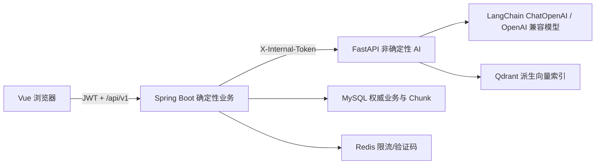
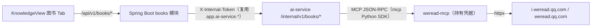

# 架构说明

系统采用“Spring Boot 模块化单体业务核心 + 独立 FastAPI AI 服务”。Java 模块按 `api / application / domain / infrastructure` 分层，正式业务状态由确定性规则维护；Python 只生成候选画像、目标/计划/任务辅导候选、派生向量、检索结果或带引用回答。LangChain 只作为 ChatOpenAI、PromptTemplate 和 HuggingFace Embedding 的适配层，不接管业务事务和权限。

核心约束：

1. 身份从 JWT 上下文注入，客户端不能指定 `userId`。
2. 发布计划时在单个数据库事务内应用变更、切换版本、写审计与 Outbox。
3. 计划、画像、题目、评分、报告均保留版本或快照。
4. Redis、模型和向量服务不可用时，核心管理与客观评分仍可运行。
5. 私有知识检索在查询阶段按所有者与空间过滤；证据不足时明确拒答。
6. 长耗时模型、文档解析和外部对象清理使用有界后台线程池；请求事务只负责落下可恢复状态，前端通过作业/资源状态轮询。

## Java 业务核心与 Python AI 服务

- 浏览器永远只访问 Java；Python 不解析用户 JWT，也不持有业务 MySQL 账号。
- Java 完成空间授权后把允许的内部 ID 传给 Python；Qdrant 再下推所有者、空间、可见性和活动索引过滤。
- Python 返回的 Chunk ID、画像更新和引用仍是不可信输入；Java 从 MySQL 二次验证后才进入模型上下文或业务事务。
- 画像草稿、目标保存、计划发布、任务、评分和审计仍由 Java 决定；Python 只生成候选结构、检索结果、任务辅导和解释文本。
- MySQL Chunk 是权威来源，Qdrant 可从 Chunk 重建。本地开发可用 Qdrant Local，Docker 使用独立 Qdrant 服务。
- 知识库驱动计划采用“显式选择空间 → Java 固化活动文档版本 → Python 三路检索 → 模型返回 Chunk ID → Java 二次鉴权 → 发布时写入 `task_knowledge_source`”链路。资料更新会改变上下文指纹，使尚未发布的旧提案失效，避免引用悄悄漂移。

## 微信读书图书（weread-mcp）

知识库页内「图书」Tab 展示微信读书书架。图书源头是仓库内**自研独立 MCP 服务器 `weread-mcp/`**（FastMCP，Streamable HTTP，默认 `:8091/mcp`），可同时被 Claude Desktop 等 MCP 客户端复用。

- **信任边界**：浏览器只访问 Java；weread-mcp 默认只监听本机，凭据（`wrk-` Key / 扫码 Cookie）只落盘在 `WEREAD_MCP_CREDENTIALS_PATH`（0600），不写日志。ai-service 无状态，仅做 MCP 客户端代理。
- **凭据归属**：微信读书账号按「部署」绑定（一个 weread-mcp 实例 = 一个账号），全站共享该账号书架；毕设单实例可接受，多用户隔离留待后续按用户分 key。
- **两种登录**：① API Key（官方 Agent Gateway，`POST i.weread.qq.com/api/agent/gateway`，`Bearer wrk-`，推荐、稳定）；② 扫码（微信读书网页版登录，社区逆向、无官方文档）。
- **校准点**：扫码登录端点与官方 Gateway 的 `api_name`/`skill_version` 无公开文档，集中在 `weread-mcp/weread_mcp/weread_client.py` 顶部常量，运行时失效只需改一处；扫码不可用时可降级为「二维码指向官方 Skill 页 + 回填 Key」。
- **离线验证**：`WEREAD_MCP_FAKE=1`（weread-mcp）与 `AI_WEREAD_MCP_FAKE=1`（ai-service）返回样例书架与自动成功的假二维码，全链路可不连真实微信读书联调；所有测试离线。

## 学习闭环的持久化

- 计划发布后，Java 只把 `knowledge_dependency` 经任务候选投影得到的真实前置边写入当前 plan scope 的 `task_dependency`；普通排期先后不等于业务依赖，Goal-level 与不同 Project 之间不会被强制串联。开始或恢复后续任务时再次校验前置状态。
- 学习者进入“任务”页时，Java 将已发布计划形成的正式任务、目标和 `task_dependency` 投影为只读知识图谱。前端展示完整路径，并仅开放用户时区下当天节点进入执行详情；未来节点可见但不可执行。
- 任务辅导使用 `tutoring_session` 和 `tutoring_message` 保存完整会话、消息及引用元数据，页面刷新后可恢复，清空操作关闭旧会话。模型调用不把“1M 上下文”当成无限容量：默认从最新消息向前选取最多 400 条、60 万字符，按时间顺序发送，剩余窗口留给系统提示、当前问题、检索证据和输出。
- `task_knowledge_source` 保存正式任务与授权 Chunk 的关系；任务详情展示文档、Chunk、页码与引用预览，文档正文仍由 `document_chunk` 作为权威来源。
- 文档可通过 `resource_category` 形成空间内的父子分类树，文档仍是检索与授权的最小权威对象。
- 评估每次评分写入 `grading_record`，掌握度重算写入 `mastery_snapshot`；分析页读取快照绘制历史趋势。
- `daily_study_stat` 保存按用户时区汇总的自动/手工时长与任务数，`scheduled_job_lock` 为多实例定时汇总提供租约锁。
- 学习总览的双进度均由 Java 分析服务从 MySQL 权威数据实时计算：`overallGoalTaskProgress` 汇总当前用户 `ACTIVE/PAUSED` 目标下全部未取消任务的预计分钟，`taskCompletionRate` 则只统计请求周期内计划执行或到期的未取消任务数量。前端只负责展示，不能提交或覆盖百分比。
- `optimization_request` 保存用户优化请求状态，并关联生成的计划版本；正式任务只在用户确认发布后改变。
- 任务完成和反馈通过可靠 Outbox 驱动学习信号与自动优化候选；消费失败按退避重试，超过阈值进入死信，避免业务事务与后续处理互相拖累。
- 画像生成、学习块生成、评估主观题批改和文档处理都显式保存 `QUEUED/RUNNING/SUCCEEDED/FAILED` 或等价业务状态，进程中断后不会伪装成成功。
- 文档/空间删除先写 `DELETING`，再清理 Qdrant 与对象存储，最终进入 `PURGED/DELETED` 或 `DELETE_FAILED`；数据库记录保留恢复与重试线索。
- 知识检索作为 Agent 工具调用写入 `agent_tool_call`，记录参数哈希、结果摘要、耗时和错误，不保存密钥。
