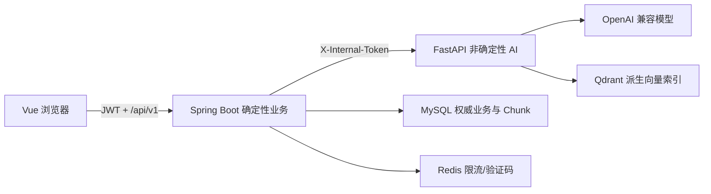

# 架构说明

系统采用“Spring Boot 模块化单体业务核心 + 独立 FastAPI AI 服务”。Java 模块按 `api / application / domain / infrastructure` 分层，正式业务状态由确定性规则维护；Python 只生成候选画像、派生向量、检索结果或带引用回答。

核心约束：

1. 身份从 JWT 上下文注入，客户端不能指定 `userId`。
2. 发布计划时在单个数据库事务内应用变更、切换版本、写审计与 Outbox。
3. 计划、画像、题目、评分、报告均保留版本或快照。
4. Redis、模型和向量服务不可用时，核心管理与客观评分仍可运行。
5. 私有知识检索在查询阶段按所有者与空间过滤；证据不足时明确拒答。

## Java 业务核心与 Python AI 服务

- 浏览器永远只访问 Java；Python 不解析用户 JWT，也不持有业务 MySQL 账号。
- Java 完成空间授权后把允许的内部 ID 传给 Python；Qdrant 再下推所有者、空间、可见性和活动索引过滤。
- Python 返回的 Chunk ID、画像更新和引用仍是不可信输入；Java 从 MySQL 二次验证后才进入模型上下文或业务事务。
- 画像草稿、计划发布、任务、评分和审计仍由 Java 决定；Python 只生成候选结构、检索结果和解释文本。
- MySQL Chunk 是权威来源，Qdrant 可从 Chunk 重建。本地开发可用 Qdrant Local，Docker 使用独立 Qdrant 服务。
