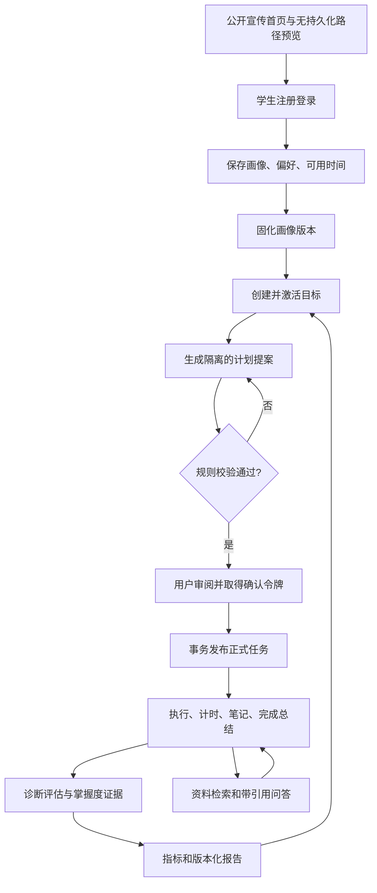
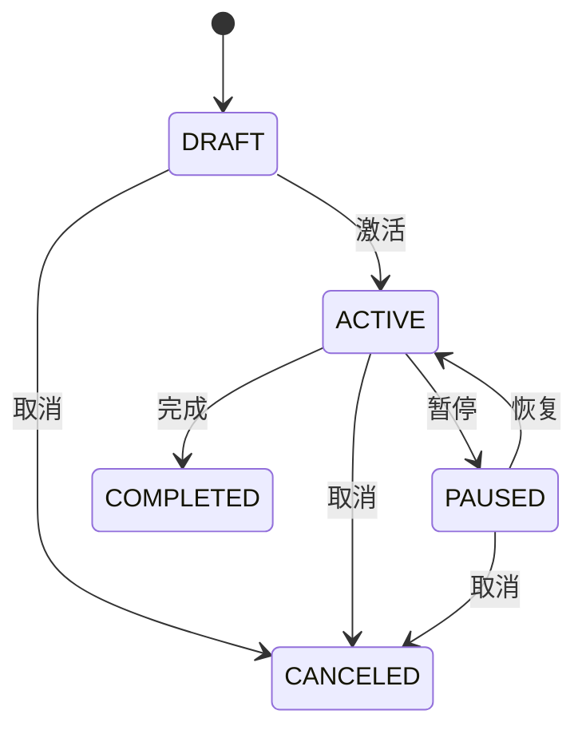

# 知序·自适应学习管理系统业务设计说明书

> 文档口径：当前仓库的真实业务实现  
> 架构同步日期：2026-07-22（Python AI 服务、Qdrant、画像与问答真实 SSE）  
> 读者：产品、开发、测试、毕业设计评审与后续维护人员  
> 目标：解释系统为什么这样设计、各模块如何协作、哪些规则不可绕过，以及当前实现与远期需求的边界。

## 1. 产品定位

### 1.1 要解决的问题

个人长期学习通常包含八类动作：判断现状、确定目标、拆分计划、安排时间、整理资料、执行任务、检验效果、根据结果调整。普通待办工具只记录“做了没有”，通用 AI 又不了解个人目标、资料来源和真实执行数据。

本系统将学习管理数据与受约束的 AI/RAG 能力放在同一条业务链中：

- 用画像记录方向、偏好和可用时间；
- 用目标、项目和里程碑表达学习成果；
- 用计划提案和发布流程保护正式任务；
- 用计时、笔记和完成总结记录真实执行；
- 用个人资料检索和带引用问答提供学习支持；
- 用诊断、错题、掌握度和统计形成反馈。

学习资料的核心边界限定为可解析、可切片、可引用的文档型内容。PDF、DOCX、Markdown、TXT 和可抽取正文的网页文章可以进入知识库、问答证据和学习报告；视频、音频、直播和不可抽取文本的材料只作为外部参考，不进入进度、掌握度和报告统计。

### 1.2 核心产品原则

1. **确定性规则优先**：权限、状态、容量、依赖、得分、事务和统计由代码控制。
2. **AI 输出不是事实**：模型回答必须受资料证据和引用白名单约束。
3. **提案与正式数据隔离**：生成计划不等于发布计划。
4. **用户保留最终决定权**：正式计划发布、文档删除等高影响操作需要确认。
5. **历史可追溯**：画像、计划、笔记、题目和报告使用版本或快照。
6. **数据归属默认私有**：学生只能访问自己的业务数据。
7. **不确定性必须展示**：掌握度与置信度分开，资料不足则拒答。

## 2. 角色与权限边界

### 2.1 学生用户

学生是学习闭环的所有者，可以管理本人：

- 账户与通知偏好；
- 学习画像、偏好、可用时间、自评和画像版本；
- 目标、项目、关联与里程碑；
- 计划提案、确认与正式任务；
- 知识空间、文档、问答会话与反馈；
- 任务执行、学习会话、笔记和总结；
- 私有题目、评估、作答、错题、掌握度与报告。

后端从 JWT 中取得用户 ID，客户端不能提交一个 `userId` 来切换数据归属。资源查询同时带“公开标识 + 当前用户”条件，避免只凭猜测 ID 访问他人数据。

### 2.2 管理员

管理员负责系统治理：

- 启用、禁用或锁定用户；
- 维护学习方向、知识点与依赖；
- 维护公共题库；
- 查看模型配置和提示词版本；
- 查看作业、系统指标与审计日志。

管理员不替学生确认计划，也不默认拥有读取学生私有资料正文的业务入口。管理员接口既受 `ADMIN` 角色保护，又可在方法级继续检查权限点。

### 2.3 外部依赖

| 外部能力 | 当前用途 | 不可用时的影响 |
|---|---|---|
| MySQL 8 | 权威业务数据、版本、审计、作业 | 核心系统不可用 |
| Redis/Memurai | 登录和模型调用限流 | 降级为单进程内存计数，数据业务仍可用 |
| Python FastAPI AI 服务 | 模型网关、画像结构化生成、目标候选生成、Embedding、检索与 RAG | Java 切换规则画像引导与规则目标候选；知识问答使用旧检索降级或明确拒答 |
| Qdrant | 可重建的 Dense 向量索引与权限过滤 | 索引/语义检索不可用；MySQL 权威 Chunk 和其他业务不受影响 |
| DeepSeek OpenAI 兼容接口 | 画像访谈、画像目标推荐与有证据的知识库答案生成 | 画像和目标推荐切换为规则候选；问答使用证据降级回答或拒答，其他模块仍可用 |
| SMTP 邮件服务 | 注册、找回密码和更换邮箱验证码 | 验证码链路安全失败；已有用户仍可登录 |
| 本地对象目录 | 保存上传文档原始对象 | 上传与后续文档处理不可用 |

当前已经接入 Qdrant 与本地 Sentence Transformers Embedding，不依赖付费 Embedding API；尚未接入 OCR、病毒扫描引擎、代码执行沙箱和生产级对象存储。SMTP 已接入，但可用性取决于部署者配置的邮箱服务。

## 3. 业务模块地图

| 业务域 | 用户价值 | 后端模块 | 前端入口 | 主要数据 |
|---|---|---|---|---|
| 产品导览与身份支撑 | 公开理解产品、预览路径、安全登录、权限、通知、审计 | `support`, `shared`；导览为纯前端 | 宣传首页、登录、设置、管理端 | 用户、角色、令牌、通知、审计；导览预览不落库 |
| 学习画像 | 描述学习条件与初始建议 | `profile` | 学习画像 | 画像、偏好、可用时间、自评、版本 |
| 目标与项目 | 定义结果和成果载体 | `goalproject` | 目标与项目 | 目标、项目、关联、里程碑 |
| 计划 | 将目标变成可执行任务 | `planning` | Agent 计划 | 计划、版本、阶段、变更、校验、确认 |
| 学习执行 | 记录任务、时长、笔记、总结 | `execution` | 今日执行 | 任务、状态历史、会话、笔记、总结 |
| 个人知识库 | 形成可检索的私有资料 | `knowledgebase` | 知识库 | 空间、文档、版本、Chunk、索引作业 |
| 知识问答 | 基于个人资料带引用答疑 | `knowledgebase`, `shared.ai` | 知识问答 | 会话、消息、引用、反馈、模型运行 |
| 评估分析 | 用证据校准掌握度和计划 | `evaluation` | 评估、学习分析 | 题目、评估、作答、错题、掌握度、报告 |

## 4. 端到端业务闭环



公开宣传首页用于解释能力和降低首次使用门槛，其互动路径由前端本地生成，不属于画像、计划或模型运行记录。正式业务从注册登录后开始。

这条链路中有三个关键分界：

- 画像草稿与画像版本分开；
- 计划提案与正式任务分开；
- 资料检索结果与模型生成文本分开。

## 5. 身份认证与账号业务规则

### 5.1 注册

- 用户名或邮箱不能重复；
- 邮箱以小写形式保存；
- 创建账户前必须校验并一次性消费 6 位邮箱验证码；
- 验证码摘要保存在 Redis，默认有效 10 分钟、60 秒内不可重发、最多错误 5 次；
- 密码使用 BCrypt，强度参数为 12，不保存明文；
- 新用户状态为 `ACTIVE`；
- 自动绑定 `STUDENT` 角色；
- 默认时区为 `Asia/Shanghai`；
- 注册后签发 Access Token 与 Refresh Token。

### 5.2 登录与锁定

- 登录名可以是用户名或邮箱；
- 非活动用户与不存在用户统一按凭据错误处理；
- 连续 5 次失败后锁定 15 分钟；
- 成功登录清零失败次数并更新最后登录时间；
- 登录接口默认每用户/来源窗口限流为每分钟 20 次。

### 5.3 找回密码与邮箱变更

- 找回密码发码对邮箱是否存在返回相同结果，避免账户枚举；
- 验证码校验成功后更新 BCrypt 密码、清除登录锁定并撤销全部刷新令牌；
- 更换邮箱必须验证新邮箱，新邮箱仍受唯一索引保护；
- SMTP 或 Redis 不可用时验证码链路安全失败，不提供固定验证码或明文降级。

### 5.4 令牌

- Access Token 默认 15 分钟；
- Refresh Token 默认 30 天；
- 刷新时采用轮换：旧令牌撤销并指向新令牌；
- 退出只撤销指定刷新令牌；
- “退出所有设备”撤销用户全部有效刷新令牌；
- 后端使用无状态 JWT，不创建服务端 HTTP Session。

## 6. 学习画像业务设计

### 6.1 画像的业务构成

画像不是一段 AI 自由文本，而是由以下结构化信息构成：

| 组成 | 说明 |
|---|---|
| 基本画像 | 时区、每周起始日、自定义计划起止日期、派生周期天数、背景说明 |
| 学习方向 | 目录方向或自定义方向、当前阶段、唯一主方向 |
| 学习偏好 | 内容形式、引导方式、任务粒度、专注时长、容量比例、难度范围 |
| 可用时间 | 星期、起止时间、分钟数、能量水平 |
| 例外日 | 某个具体日期覆盖普通每周规则 |
| 自评 | 知识点、0～5 等级、最近学习日期和备注 |
| 画像版本 | 某次生成的只读快照、置信度和触发信息 |

### 6.2 校验规则

- 时区必须是合法 IANA 时区；
- 每周起始日在 1～7；
- 计划周期在 1～365 天；
- 背景说明最多 2000 字；
- 至少选择一个方向；
- 必须且只能有一个主方向；
- 自定义方向名称不能为空；
- 目录方向必须处于 `ACTIVE`；
- 内容形式至少一个，只允许 TEXT/PRACTICE；其中 TEXT 表示文档阅读，PRACTICE 表示基于文档或题库的练习测验；
- 专注时长为 10～180 分钟；
- 容量比例为 0.60～0.95；
- 难度范围为 1～5，且最小值不能高于最大值；
- 自评等级为 0～5。

### 6.3 对话式采集与确认边界

- 每个用户同一时刻最多一个活动访谈，会话和消息按用户隔离；
- 模型只返回经过后端枚举、日期、长度和时段规则校验的结构化草稿；
- 字段保存用户说明依据，页面同时展示缺失项和完成度；
- 对话轮次不修改正式画像，只有用户携带最新会话版本确认后才在事务中落库；
- 模型未配置、超时、限流或输出不合规时，降级为确定性提取和逐项追问；
- 明显的密钥、授权码和提示注入内容在进入模型前被拒绝；模型运行只保存输入哈希、输出哈希、用量和错误码，不保存密钥。

### 6.4 可用时间规则

- 开始和结束相同无效；
- 结束早于开始视为跨午夜，并拆成两个标准时段；
- 同一天的标准化时段不能重叠；
- 单日累计最多 960 分钟；
- 未来 30 天预览优先使用例外日，再回退到每周规则。

### 6.5 画像版本生成规则

当前实现采用同步确定性规则并包装成生成作业：

1. 创建状态为 `RUNNING` 的画像生成作业；
2. 读取当前画像和全部自评；
3. 生成快照；
4. 写入递增的 `profile_version`；
5. 更新画像当前版本和 `GENERATED` 状态；
6. 作业进入 `SUCCEEDED`。

当前计算结果：无自评时置信度 0.10、推荐难度 1；有自评时置信度 0.20、推荐难度 2；每日建议任务固定为 2。每次请求会创建新版本，即使推荐结果没有改变。

**当前边界**：AI 画像访谈调用模型整理草稿；确认后的画像版本指标仍不调用大模型，也尚未把诊断评估的掌握度聚合进快照。

## 7. 目标、项目与里程碑业务设计

### 7.1 目标

目标表达“在一定周期内达到什么结果”，包含方向、名称、描述、类型、起止日期、优先级、每周预算和成功标准。

目标支持“用户自定义”和“基于画像推荐”两种创建方式。自定义目标允许新用户先从学习目录选择方向并创建 `DRAFT` 草稿，不强制先完成画像；激活和规划阶段仍会读取用户可用时间与容量。推荐链路读取当前已固化画像版本中的方向、阶段、周期、偏好和时间容量，由 Python 生成结构化候选，再由 Java 做目录方向、日期、容量、字段和画像归属校验。候选本身不落库、不激活目标；只有用户进入确认框并提交后，才创建 `DRAFT` 目标。

推荐目标保存 `source_type`、`profile_version_id` 和确认时的推荐理由快照。画像后续生成新版本时，旧目标仍指向原版本，从而可以解释“当时为什么推荐这个目标”。画像或可用时间发生修改后会回到 `DRAFT`，必须先生成新版本才允许再次推荐，避免把新画像数据错误归因到旧版本。Python或模型不可用时，Java生成受容量约束的规则候选，并显式标记为 `RULE_RECOMMENDED`。

目标方向必须落在学习目录中，因为计划拆解、知识点依赖、诊断题和报告统计都依赖 `direction_id`。自定义目标校验目录方向是否有效；画像推荐目标还会额外校验该方向属于当前画像，避免模型把不在用户画像内的方向伪装成推荐。V6 迁移新增“经济学、微观经济学、宏观经济学、经济学思维与应用”四个目录方向，并配套文档化知识点与公共诊断题；这让非计算机方向也能走通画像、目标、计划和评估闭环。用户访谈中出现“经济学”等目录名称时会优先映射为目录方向，只有目录无法匹配时才保留为纯自定义方向。



完成和取消为终态。目标更新使用乐观锁版本，防止旧页面覆盖新数据。

### 7.2 项目

项目表达“为了目标交付什么成果”，包含主方向、周期、优先级、成果物和可选代码仓库地址。

项目状态在目标状态基础上增加归档：`COMPLETED` 或 `CANCELED` 可以进入 `ARCHIVED`。归档后不再参与活动业务。

### 7.3 目标与项目关系

一个目标可关联多个项目，一个项目也可以服务多个目标。关联表保存贡献权重和是否主项目。项目进度可由里程碑、任务或手工规则汇总，但不能直接把客户端传入的百分比当作权威值。

### 7.4 里程碑和依赖

里程碑是可验收的阶段节点，不等同于每日任务。任务依赖和知识点前置关系都必须是无环图；新增依赖形成环时，业务层拒绝保存。

## 8. 计划业务设计

### 8.1 为什么要使用提案

计划生成可能一次增加、修改、拆分、重排或取消多个任务。如果生成结果直接写正式任务，会造成误修改、并发覆盖和不可解释历史。因此系统使用：

```text
规划上下文 → 计划版本提案 → 变更清单 → 校验结果 → 用户确认 → 事务发布
```

提案阶段只写计划版本及差异，不改变正式任务。

### 8.2 当前规划器

当前 `RuleBasedPlanner` 读取活动目标、画像、可用时间和配置规则，生成结构化任务变更。它是可测试的确定性规则规划器，并非 DeepSeek 规划调用。

当前 AI Agent 的产品表达主要体现在“隔离提案、受约束工具、校验、确认、发布和审计”这一套治理流程。未来若接入大模型规划器，输出仍必须进入相同流程，不能绕过规则层。

### 8.3 计划版本与变更动作

计划版本保存触发类型、风险等级、提案哈希、上下文快照与状态。变更动作只允许：

- `ADD_TASK`；
- `RESCHEDULE_TASK`；
- `UPDATE_TASK`；
- `SPLIT_TASK`；
- `CANCEL_TASK`。

每个变更保留变更前、变更后、原因、风险和是否需要确认。

### 8.4 校验规则

| 规则 | 业务含义 |
|---|---|
| 标题 2～200 字 | 防止空任务和不可展示文本 |
| 时长 10～120 分钟 | 保持任务可执行，避免过小或过大 |
| 时间范围合法 | 截止必须晚于开始 |
| 目标周期内 | 不允许任务安排在目标外 |
| 同日去重 | 同一天同标题视为冲突 |
| 容量上限 | 当日任务分钟数不超过可用时间乘容量比例 |
| 状态合法 | 不能修改终态或不允许变化的任务 |
| 上下文未过期 | 画像、目标、任务变化后旧提案不能直接发布 |

全局默认容量比例为 0.85。每日容量取向下取整，避免舍入后超过用户时间。

### 8.5 确认与发布

- 确认令牌默认有效 30 分钟；
- 确认与提案版本、用户、哈希绑定；
- 发布请求必须带新的 `Idempotency-Key`；
- 同键同请求返回同结果；同键不同请求视为冲突；
- 发布在单数据库事务中应用任务、更新正式版本、写发布记录、审计和 Outbox；
- 任一步失败全部回滚；
- 已发布版本不可原地改写。

### 8.6 风险与高影响

默认高影响批量阈值为 3 个任务，影响观察窗口为 14 天。当前页面对发布统一进行显式确认；后端仍负责判断令牌、状态和上下文，不能只信任前端按钮。

## 9. 学习任务与执行业务设计

### 9.1 双状态设计

任务生命周期回答“任务做到什么阶段”，排期状态回答“它在时间上是否逾期”。两者分开避免以下错误：

- 已暂停任务被强制改成逾期生命周期；
- 截止已过就自动变成完成或取消；
- 修改时间窗口时破坏执行历史。

常见排期状态可根据当前时间计算为未到期、进行窗口、即将到期、逾期；它不是任务表的主要生命周期字段。

### 9.2 生命周期

| 当前状态 | 合法目标状态 |
|---|---|
| `NOT_STARTED` | `IN_PROGRESS`, `BLOCKED`, `CANCELED` |
| `IN_PROGRESS` | `PAUSED`, `BLOCKED`, `COMPLETED`, `CANCELED` |
| `PAUSED` | `IN_PROGRESS`, `BLOCKED`, `COMPLETED`, `CANCELED` |
| `BLOCKED` | `IN_PROGRESS`, `CANCELED` |
| `COMPLETED` | `PAUSED`，仅受控反转 |
| `CANCELED` | 无 |

每次转换保存前后状态、原因和时间，并产生审计/领域事件。

### 9.3 学习会话

- 会话绑定用户和任务；
- 开始、暂停、继续、停止使用服务端时间；
- 暂停区间单独记录；
- 停止后计算有效秒数；
- 跨午夜按用户时区分配到不同日期；
- 重复停止不能重复累计；
- 手工补录与自动计时在统计中分开。

### 9.4 笔记与完成总结

笔记以 Markdown 保存，更新时生成新版本。完成总结可包含学到的内容、困难、质量等级、信心等级和遗留问题；质量和信心等级都限制为 1～5。历史总结以修订号追踪。

## 10. 知识库与文档业务设计

### 10.1 数据边界

知识空间归属于用户。文档、版本、Chunk、问答会话和引用都必须通过空间归属间接或直接验证用户权限。检索前先下推用户与空间过滤，不能先全库检索再在应用层删除越权结果。

### 10.2 文档流水线


关键规则：

- 请求和单文件上限约 50 MB；
- 支持 PDF、DOC/DOCX、Markdown、TXT；
- 原始文件名只作为展示元数据，不作为对象路径；
- 对象目录不可执行；
- 文本目标块约 600 字，最大 1600 字；
- Chunk 与文档版本绑定；
- 重试不能产生重复的活动索引版本；
- 历史问答引用固定到当时的文档版本。

### 10.3 当前向量实现

Java 完成文件安全检查、Tika 文本提取、切块并把 Chunk 写入 MySQL；Python 使用 `AI_EMBEDDING_MODEL` 配置的 Sentence Transformers 模型生成 Dense Embedding，以 Java `chunkId` 为 Point ID 写入 Qdrant。索引先标记 `STAGING`，整批校验后切换 `ACTIVE`。MySQL Chunk 是权威数据，Qdrant 是可重建派生数据。

本地/测试若未安装模型且显式允许，可回退 `LOCAL_HASHED_384` 并在健康响应标记 `degraded=true`。Java 数据库中的 `LOCAL_HASHED_128` 仅保留为迁移回滚检索，不再是 Python 主链路。

### 10.4 删除

删除采用“请求删除令牌 → 用户确认 → 清除”的两段式流程。删除完成后文档立即不能进入新检索，状态进入 `PURGED`；相关审计和历史引用标识仍用于可追溯性。

## 11. RAG 知识问答业务设计

### 11.1 检索

问答只在用户显式选中的知识空间内检索。Java 先把用户有权访问的内部空间 ID 传给 Python，Qdrant 下推 `spaceId/ownerUserId/visibility/indexStatus` 过滤；Python 返回 Chunk ID 后 Java 再查 MySQL 二次鉴权。P0 综合分默认是：

```text
综合分 = 0.85 × Dense 向量归一化分 + 0.15 × 关键词覆盖分
```

默认先召回 20 个候选，再去重、限制单文档占比并返回前 5 个片段。默认阈值 0.18，可通过离线评测调整；证据不足时不调用模型。

### 11.2 模型调用条件

只有 Python AI 服务已启用、模型配置完整、用户未超限且证据充分时，Python 才调用 DeepSeek OpenAI 兼容 `/chat/completions`。Java 保留每用户每分钟 20 次限流；Python 默认全局并发 8、完整超时 60 秒、最大输出 Token 1200。浏览器和 Java 业务层都不直接持有供应商调用逻辑。

### 11.3 引用白名单

后端为入模片段分配引用代码，模型只能返回这些代码。回答后处理会校验引用是否属于白名单。模型伪造、遗漏或使用不存在的引用时，系统不把它当作可信带引用回答，而是降级或拒答。

### 11.4 模型运行记录

`model_run` 保存：

- 用户、用途和模型名；
- 状态与错误类型；
- 输入/输出 Token；
- 延迟；
- 输入、输出或证据的哈希/必要追踪字段。

API Key 不进入该表。该记录既用于故障定位，也用于成本与限流审计。

### 11.5 降级策略

| 情况 | 业务结果 |
|---|---|
| 无检索命中或分数太低 | 明确证据不足 |
| 模型未配置 | 使用证据降级回答/拒答 |
| 模型超时或供应商错误 | 记录失败并降级，不影响管理功能 |
| 模型伪造引用 | 拒绝不可信输出，使用受控结果 |
| Redis 不可用 | 使用本机限流计数器 |

## 12. 评估、错题与掌握度业务设计

### 12.1 题目和评估

题目使用版本表保存题干、选项、答案、评分规则、解析和难度。评估发布时保存题目快照，后来修改题库不会无痕改变历史试卷。

诊断从公共、已发布、与方向知识点相关的题目中选择，难度范围为所选等级上下一级，题量约为 `max(1, 时长分钟 / 3)`。

### 12.2 作答与交卷

- 尝试开始后按题号保存答案；
- 答案可实时覆盖，交卷后不再修改；
- 交卷需要幂等键；
- 客观题由规则比对；
- 单选、多选、判断和填空当前可自动评分；
- 主观题当前标记 `PENDING_REVIEW`/`AI_PENDING`，并未实现可作为正式结果的 AI 自动评分；
- 错误客观题写入错题本；
- 评分产生掌握度证据。

### 12.3 掌握度模型

掌握度证据分为：题目/评估 `Q`、复习 `R`、项目 `P`、自评 `S`。基础权重分别为 0.55、0.20、0.15、0.10，只对实际存在的分量重新归一化。

每条证据按约 30 天半衰期衰减。难度影响题目证据权重：难度 1 为 0.8、2 为 0.9、3 为 1.0、4 为 1.1、5 为 1.2。

置信度由三部分组成：

```text
置信度 = 0.5 × 客观证据数量充分度
       + 0.3 × 证据类型多样性
       + 0.2 × 近 30 天证据新鲜度
```

只有自评证据时，置信度封顶 0.2。掌握度等级：

| 分数 | 等级 |
|---:|---|
| 0～39.9 | `NOT_MASTERED` |
| 40～59.9 | `WEAK` |
| 60～79.9 | `BASIC` |
| 80～100 | `PROFICIENT` |

置信度低于 0.4 时等级带 `TENTATIVE_` 前缀，表示结论暂定。

## 13. 学习分析与报告业务设计

### 13.1 指标口径

关键指标由后端统一返回：

- 有效学习秒数；
- 任务完成率；
- 按时完成率；
- 逾期率；
- 每日自动计时和手工补录；
- 掌握度与置信度。

比率响应同时包含 `value`、`numerator`、`denominator`、`timezone`、`refreshedAt` 和 `metricVersion`。分母为 0 时 `value=null`，业务含义是“不适用”，不是 0%。

### 13.2 报告

报告按用户、类型和周期保存。相同周期重新生成时增加修订号，旧报告保留。报告中的统计是生成时快照，不因后来补录数据而无痕变化。前端生成成功后自动打开详情，并允许从历史列表按公开 ID 查看任一本人报告；详情展示周期总结、指标值及分子/分母、时区、版本和掌握度证据，后端查询必须同时限定当前用户。

## 14. 数据一致性机制

### 14.1 乐观锁

用户、画像、偏好等可编辑资源带版本号。更新必须提交当前版本；影响行数不是 1 时返回版本冲突，提示刷新后重试。

### 14.2 幂等

计划生成、计划发布和评估交卷等可能重复提交的操作使用 `Idempotency-Key`。服务器保存请求哈希和结果：

- 同键 + 同请求：返回已有结果；
- 同键 + 不同请求：拒绝，防止一个键代表两个动作。

### 14.3 事务

需要原子一致性的操作使用数据库事务，尤其是计划发布和评估交卷。业务不依赖前端“只点一次”维持正确性。

### 14.4 版本与快照

| 对象 | 版本策略 |
|---|---|
| 学习画像 | 每次生成新增画像版本 |
| 计划 | 每个提案/发布生成计划版本 |
| 笔记 | 每次保存新增笔记版本 |
| 文档 | 替换文件生成文档版本，Chunk 绑定版本 |
| 题目 | 修改内容生成题目版本，评估保存快照 |
| 报告 | 同周期重复生成增加修订号 |

### 14.5 Outbox 与审计

发布等操作把领域事件写入 Outbox，与业务事务一起提交，避免“数据库成功但事件丢失”。审计记录重要创建、状态变更、发布、删除和管理员操作。

## 15. 安全与隐私规则

- 除注册、登录、刷新、健康检查和 OpenAPI 外，接口都需认证；
- 管理接口必须有 `ADMIN` 角色；
- 密码 BCrypt 哈希，刷新令牌只保存哈希；
- 模型 API Key 只从环境变量读取；
- 文件使用随机对象键，不执行上传内容；
- Markdown/模型答案展示前清理 XSS；
- 错误响应不返回堆栈和敏感内部信息；
- CORS 只允许配置的前端来源；
- 私有检索必须先验证空间归属；
- 模型输出视为不可信输入，不直接执行数据库动作。

## 16. 状态、错误与前端行为

前端根路由 `/` 是公开产品导览，`/login` 是公开认证入口，`/dashboard` 及其他业务路由由认证守卫保护。宣传页的交互预览必须与正式数据写入保持边界：不复用正式计划发布接口，不暗示已经保存，并为登录、注册和返回工作台提供明确入口。

统一成功结构为：

```json
{
  "success": true,
  "data": {},
  "requestId": "..."
}
```

失败结构包含稳定错误码、中文消息和 `requestId`。前端应按错误码决定业务行为，不解析中文文本作为程序条件。

常见错误：

| HTTP | 错误类型 | 业务含义 |
|---:|---|---|
| 400 | 校验错误 | 字段缺失、范围或格式错误 |
| 401 | 未认证/令牌失效 | 重新登录或刷新令牌 |
| 403 | 无权限 | 角色或权限点不满足 |
| 404 | 资源不存在 | 也用于隐藏他人私有资源是否存在 |
| 409 | 版本/状态/幂等冲突 | 刷新、检查状态或更换幂等键 |
| 413 | 文件过大 | 压缩或拆分文件 |
| 415 | 文件类型不支持 | 使用允许格式 |
| 422 | 业务规则不满足 | 容量、证据或确认条件未满足 |
| 429 | 限流 | 等待窗口结束 |
| 502/504 | 模型错误/超时 | 降级并记录模型运行失败 |

## 17. 当前 AI 使用矩阵

| 功能 | 是否调用 DeepSeek | 当前实现 |
|---|---|---|
| 画像对话采集 | 是，配置有效时 | Python结构化 SSE；Java校验合并，用户确认后才落库 |
| 画像版本指标 | 否 | 根据自评数量生成固定规则快照 |
| 基于画像的目标推荐 | 是，配置有效时 | Python生成结构化候选；Java校验方向、周期、容量和画像版本；用户确认后才创建目标，失败时规则降级 |
| Agent 计划生成 | 否 | `RuleBasedPlanner` 确定性拆分与排期 |
| 知识库向量生成 | 不调用对话模型 | Python Sentence Transformers + Qdrant；可显式 Hash 降级 |
| 知识库问答 | 是，条件满足时 | Python权限过滤检索与 RAG SSE；Java二次鉴权、引用落库 |
| 客观题评分 | 否 | 标准答案规则比对 |
| 主观题评分 | 否，当前未完成正式评分 | 标记为待复核/AI_PENDING |
| 掌握度计算 | 否 | 可解释的证据加权规则 |
| 学习分析与报告数字 | 否 | SQL 与后端统计服务 |

这张表是验收和成本分析的权威口径。不能因为页面上出现“AI”或“Agent”字样，就判断已经发生供应商模型调用。

## 18. 当前实现限制与需求差距

以下内容是明确的当前边界，应在答辩或后续迭代中如实说明：

1. 画像版本指标规则仍较简化，只区分是否存在自评；目标推荐已经使用画像方向、阶段、周期、偏好和时间容量，但尚未纳入诊断掌握度与近期执行趋势；
2. 计划生成由规则引擎完成，尚未接入大模型结构化计划输出和工具调用；
3. P0 已接入 Dense Embedding/Qdrant，但尚未增加独立 Sparse/BM25 召回和 Cross-Encoder Reranker；
4. 扫描 PDF 没有 OCR；
5. 主观题只进入待复核，尚未形成可申诉的 AI 评分闭环；
6. 前端管理员页以查看和基础操作为主，部分完整维护能力只在 API 中；
7. 提示词和模型配置数据库表用于治理展示，Python实际供应商连接仍以 `MODEL_*` 映射的 `AI_MODEL_*` 环境变量为准；
8. 当前没有开放互联网搜索、多模态音视频转录、视频进度量化、日历同步和任意代码执行；
9. 优化请求和重排接口已存在，但前端完整的自动动态优化体验仍有限；
10. 生产级容量、故障切换和安全基线仍需网关、TLS、备份与监控平台配合。

这些差距不改变当前闭环可运行，但会影响“完全满足详细需求文档全部增强项”的表述。

## 19. 关键验收场景

### 19.1 学习闭环

新用户应能完成：注册 → 画像版本 → 活动目标 → 计划提案 → 校验与确认 → 发布任务 → 今日计时和笔记 → 任务完成 → 诊断交卷 → 分析报告。

### 19.2 安全隔离

用户 B 使用用户 A 的目标、空间、文档、会话、任务或评估公开 ID 时，必须返回 404/403，不能泄露内容。

### 19.3 计划安全

- 超容量提案不能发布；
- 未确认不能发布；
- 确认后上下文发生变化应拒绝旧提案；
- 相同幂等键重复发布不产生重复任务；
- 发布中任意任务失败时整体回滚。

### 19.4 RAG 可信度

- 资料中有答案时返回可访问引用；
- 资料中没有答案时拒答；
- 伪造空间 ID 不产生跨用户命中；
- 模型伪造引用时不展示为可信答案；
- `model_run` 能证明真实调用和 Token 用量。

### 19.5 评估一致性

- 答案可保存；
- 重复交卷只评分一次；
- 历史评估不受后来题目修改影响；
- 错题和掌握度证据与评分一致；
- 只有自评时置信度不超过 0.2。

## 20. 运营与维护指标建议

当前系统已经能记录或推导以下指标，后续运营可建立看板：

- 注册用户、活跃用户、登录失败和锁定数量；
- 活动目标、计划提案通过率、发布成功率；
- 每日任务数、任务完成率、按时率、逾期率；
- 学习会话总时长和异常长会话；
- 文档处理成功率、平均 Chunk 数、失败重试次数；
- RAG 证据充分率、模型成功率、平均 Token 和 P95 延迟；
- 回答有帮助率和需改进原因；
- 评估完成率、错题率、掌握度分布和低置信知识点；
- 报告生成成功率与修订次数；
- 审计失败操作、越权访问和管理员高影响操作。

## 21. 业务变更时的判断顺序

新增或修改功能时，依次回答：

1. 数据属于哪个用户或角色？
2. 它是草稿、提案、正式数据还是历史快照？
3. 状态从哪里到哪里，非法转换是什么？
4. 是否需要版本号、事务、幂等键或确认令牌？
5. 外部模型失败时，核心业务如何降级？
6. AI 输出需要怎样的结构、白名单和后端校验？
7. 是否写审计和 Outbox？
8. 页面如何明确展示不确定性、失败与当前状态？

只有这些问题都有明确答案，功能才符合本系统的业务设计原则。
