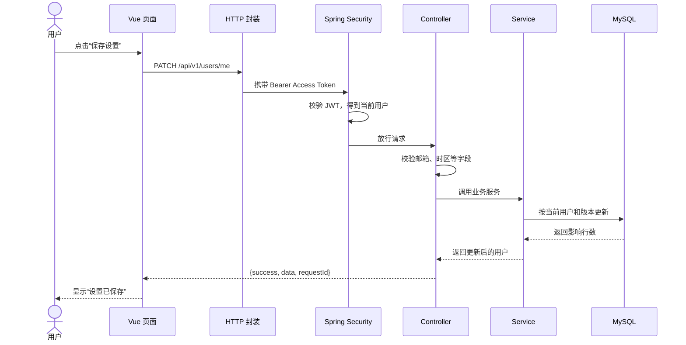
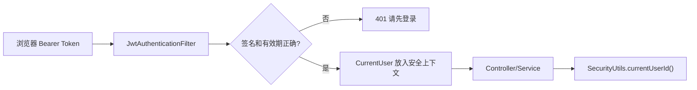
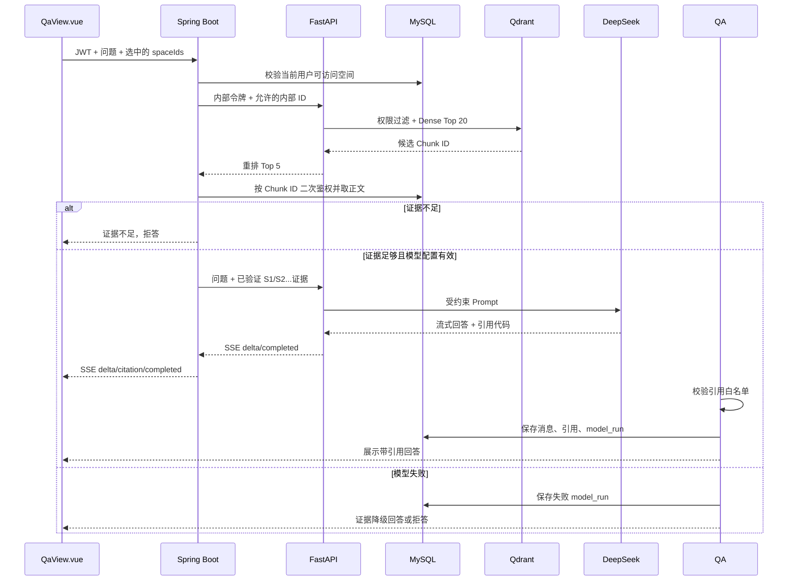
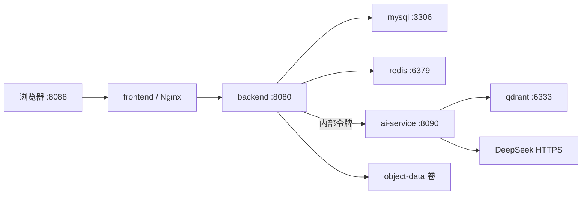

# 小白也能看懂的项目全景指南

> 这不是一份只列技术名词的说明，而是从“页面点一下之后发生了什么”开始，带你理解 Vue、Java、Python AI、MySQL、Redis、Qdrant 和 DeepSeek 如何组成整个项目。本文已于 2026-07-22 同步独立 Python AI 服务架构。

## 1. 先把系统想成一家学习服务中心

如果把项目比作一家店：

| 项目组成 | 类比 | 实际职责 |
|---|---|---|
| Vue 前端 | 店里的服务窗口 | 展示页面、收集输入、发请求、显示结果 |
| Spring Boot 后端 | 业务工作人员 | 检查身份、权限和确定性规则，组织事务并决定能不能做 |
| Python FastAPI AI 服务 | AI 专家协调室 | 调用模型、生成画像候选、制作向量、检索资料并流式生成答案 |
| MySQL | 权威档案室 | 永久保存用户、目标、任务、文档索引、评估和审计 |
| Redis | 门口快速计数器 | 记录短时间内登录/模型请求次数，用来限流 |
| 本地对象目录 | 文件仓库 | 保存用户上传的 PDF、Word、Markdown、TXT |
| Qdrant | 可重建的资料索引卡 | 保存 Python 生成的向量，并按用户、空间和可见性过滤 |
| DeepSeek API | 外部语言专家 | 通过 Python 完成画像访谈和有证据的知识库回答 |
| Nginx | Docker 模式的前台总入口 | 把网页请求和 `/api` 请求转发到正确服务 |

最重要的一点：**MySQL 是业务事实，AI 和 Qdrant 都不是业务事实。** Python 只能生成候选画像、检索结果和回答；Java 必须重新校验权限与字段，用户确认后才能修改正式业务数据。

## 2. 一次点击到底经历了什么

以“保存账户设置”为例：



任何一步出错，后端都会返回稳定错误码和 `requestId`。前端负责把消息展示出来，但最终规则以后端为准。

## 3. 项目目录怎么读

项目根目录：

```text
LAgent/
├─ backend/                  Java 后端
├─ frontend/                 Vue 前端
├─ docs/                     项目文档
├─ scripts/                  Windows 本地启动脚本
├─ docker-compose.yml        一次启动完整 Docker 环境
├─ .env                      你本机的真实配置，不提交 Git
├─ .env.example              配置模板，不含真实密钥
└─ README.md                 项目首页和文档导航
```

学习代码时不要从所有文件逐个看。推荐顺序：

1. 先看 `frontend/src/router.ts`，知道有哪些页面；
2. 选一个页面，例如 `ProfileView.vue`；
3. 找页面调用的 `/api/v1/...`；
4. 在后端搜索对应 `Controller`；
5. 从 Controller 进入 Service；
6. 再看 Entity、Mapper 和数据库表；
7. 最后看规则测试，确认边界。

## 4. 前端是什么

### 4.1 技术组成

| 技术 | 用途 |
|---|---|
| Vue 3 | 页面组件和响应式数据 |
| TypeScript | 给 JavaScript 增加类型检查 |
| Vite | 开发服务器和生产构建 |
| Pinia | 保存登录用户等全局状态 |
| Vue Router | 地址与页面的对应关系、登录守卫 |
| Element Plus | 表单、表格、按钮、弹窗等组件 |
| Axios | 发送 HTTP 请求 |
| ECharts | 学习时长等图表 |
| markdown-it | 把 Markdown 转成 HTML |
| DOMPurify | 清理危险 HTML，防止脚本注入 |

### 4.2 入口文件

`frontend/src/main.ts` 是前端启动入口，它创建 Vue 应用、安装 Pinia、路由和 Element Plus，然后挂到网页的根节点。

`frontend/src/App.vue` 是最外层组件。公开产品入口由 `frontend/src/views/LandingView.vue` 提供；真正的登录后页面框架在 `frontend/src/layout/AppLayout.vue`，它负责侧边导航、顶部区域和子页面出口。

### 4.3 路由

`frontend/src/router.ts` 把 URL 映射到页面：

| URL | 页面文件 | 功能 |
|---|---|---|
| `/` | `LandingView.vue` | 公开宣传、功能切换和无持久化路径预览 |
| `/login` | `AuthView.vue` | 登录、注册与找回密码 |
| `/dashboard` | `DashboardView.vue` | 学习总览 |
| `/onboarding` | `ProfileView.vue` | 学习画像 |
| `/goals` | `GoalsView.vue` | 目标与项目 |
| `/plans` | `PlansView.vue` | 计划提案、校验和发布 |
| `/today` | `TodayView.vue` | 今日任务、计时和笔记 |
| `/knowledge` | `KnowledgeView.vue` | 知识空间与文档 |
| `/qa` | `QaView.vue` | RAG 知识问答 |
| `/assessments` | `AssessmentView.vue` | 评估、错题和掌握度 |
| `/analytics` | `AnalyticsView.vue` | 学习分析与报告 |
| `/settings` | `SettingsView.vue` | 账户和通知设置 |
| `/admin` | `AdminView.vue` | 管理员治理页面 |

`/` 和 `/login` 是公开路由。宣传首页不会因为用户已经登录就自动消失，而是把主按钮改为“进入工作台”；未登录用户点击注册按钮时会导航到 `/login?mode=register`。宣传页内生成的路径只是前端响应式交互，不发业务请求、不保存数据。

路由守卫还负责两项保护：未登录访问业务页时跳到登录页；普通用户访问管理页时跳回总览。它改善用户体验，但后端仍会再次检查权限，不能把前端守卫当作安全边界。

### 4.4 HTTP 封装

`frontend/src/api/http.ts` 是所有页面请求后端的共同入口。它主要负责：

- 给 URL 自动加 `/api/v1` 前缀；
- 从本地登录状态读取 Access Token；
- 加上 `Authorization: Bearer ...`；
- 解开统一响应中的 `data`；
- 处理令牌过期、错误消息和刷新逻辑。

所以页面代码可以写：

```ts
await api({ method: 'POST', url: '/goals', data: form })
```

浏览器实际请求的是 `/api/v1/goals`。

### 4.5 登录状态

`frontend/src/stores/auth.ts` 使用 Pinia 保存：

- Access Token；
- Refresh Token；
- 当前用户；
- 是否登录；
- 是否管理员。

页面刷新后会从浏览器 Local Storage 恢复。不同端口属于不同网站来源，所以 `localhost:5300` 和 `localhost:8088` 的登录状态不共用。

### 4.6 如何新增一个页面

假设要新增“学习日历”：

1. 创建 `frontend/src/views/CalendarView.vue`；
2. 在 `router.ts` 的 children 中添加 `/calendar`；
3. 在 `AppLayout.vue` 添加菜单；
4. 在页面 `onMounted` 时调用后端接口；
5. 给加载、空数据、成功和失败状态都提供反馈；
6. 运行 `npm run build` 做 TypeScript 和生产构建检查。

## 5. 后端是什么

### 5.1 技术组成

| 技术 | 用途 |
|---|---|
| Java 17 编译目标 | 后端编程语言版本；本地可用 JDK 21 |
| Spring Boot 3.3.5 | 应用启动、Web、配置和依赖装配 |
| Spring MVC | Controller 与 REST 接口 |
| Spring Security | JWT 认证、角色和权限保护 |
| Bean Validation | `@NotBlank`、`@Min` 等请求字段校验 |
| MyBatis-Plus | Entity、Mapper 和数据库 CRUD |
| JdbcTemplate | 复杂或直接 SQL 查询 |
| Flyway | 启动时管理数据库结构版本 |
| Spring Data Redis | Redis 访问 |
| Apache Tika | 从文档中提取文本 |
| Springdoc OpenAPI | 生成 Swagger 接口文档 |
| Actuator | 健康检查和运行指标 |

### 5.2 启动入口

`backend/src/main/java/com/adaptivelearning/LearningApplication.java` 是后端主类。启动后 Spring 会扫描 `com.adaptivelearning` 下的组件，建立数据库连接、安全过滤器、Controller 和 Service。

### 5.3 模块化单体

项目是“模块化单体”：部署时只有一个后端进程，但代码按业务域拆分。

```text
com.adaptivelearning/
├─ support/        登录、用户、通知、管理、审计
├─ profile/        学习画像
├─ goalproject/    目标与项目
├─ planning/       计划提案和发布
├─ execution/      任务、计时、笔记、辅导
├─ knowledgebase/  文档、检索、问答
├─ evaluation/     题目、评估、掌握度、分析
└─ shared/         安全、统一响应、异常、AI 客户端、限流
```

它比一开始拆成多个微服务简单：本地只需启动一个 Java 应用，计划发布也可以用一个数据库事务完成。

### 5.4 每个模块的四层

大部分模块按下面组织：

| 层 | 典型文件 | 用途 |
|---|---|---|
| `api` | `ProfileController.java` | 接收 HTTP 请求、校验字段、返回响应 |
| `application` | `ProfileService.java` | 组织业务流程和事务 |
| `domain` | `UserProfileEntity.java`, `GoalStatus.java` | 业务对象、状态机和规则 |
| `infrastructure` | `ProfileMappers.java` | 访问数据库 |

可以把 Controller 理解为“窗口人员”，Service 是“办理流程”，Domain 是“规章制度”，Mapper 是“档案室操作员”。

### 5.5 统一响应和错误

正常响应：

```json
{
  "success": true,
  "data": {
    "example": "value"
  },
  "requestId": "请求追踪号"
}
```

业务异常由 `BusinessException` 表达，错误码定义在 `ErrorCode.java`。`GlobalExceptionHandler.java` 把各种异常转换成统一 JSON。`RequestIdFilter.java` 为每个请求生成或传递追踪号，方便把页面错误与日志对应起来。

### 5.6 认证链路



`SecurityConfig.java` 允许匿名访问注册、登录、健康检查和 Swagger，其余接口要求登录；`/api/v1/admin/**` 还要求管理员角色。

### 5.7 配置从哪里来

`backend/src/main/resources/application.yml` 提供默认值，并允许环境变量覆盖。例如：

```yaml
spring:
  datasource:
    url: ${DB_URL:默认数据库地址}
```

意思是“先读 `DB_URL`，没有才用冒号后的默认值”。本地启动脚本读取根目录 `.env`，设置环境变量，再启动 Maven。

## 6. 数据库是什么

### 6.1 MySQL 是权威数据源

页面关掉、后端重启、Redis 清空后，用户目标和任务仍存在，因为它们在 MySQL。Redis 不是主数据库，DeepSeek 也不保存本系统业务状态。

数据库名默认是 `adaptive_learning`，本地账号通常是 `learning`。数据库结构由 Flyway 自动创建，不需要手工逐张建表。

### 6.2 Flyway 如何工作

迁移文件位于：

```text
backend/src/main/resources/db/migration/mysql/V1__baseline_schema.sql
```

后端启动时，Flyway 检查 `flyway_schema_history`：

- 没执行过 V1：创建表、索引、约束和初始目录/题库；
- 已经执行过：不重复执行；
- 已发布迁移内容被改动：校验可能失败。

以后修改数据库应增加 `V2__说明.sql`、`V3__说明.sql`，不要随意改已经在其他环境执行过的 V1。

### 6.3 表为什么这么多

这个项目不仅保存“当前值”，还保存版本、状态历史、确认记录、证据和审计，所以表较多。可以按业务组理解。

#### 身份与权限

| 表 | 作用 |
|---|---|
| `sys_user` | 用户名、邮箱、密码哈希、状态、时区、锁定信息 |
| `sys_role` | STUDENT、ADMIN 等角色 |
| `sys_permission` | 细粒度权限点 |
| `sys_user_role` | 用户和角色关系 |
| `sys_role_permission` | 角色和权限关系 |
| `refresh_token` | 刷新令牌哈希、设备、过期和撤销时间 |

#### 画像

| 表 | 作用 |
|---|---|
| `user_profile` | 当前画像基本信息和当前版本号 |
| `user_profile_direction` | 学习方向和唯一主方向 |
| `learning_preference` | 内容形式、专注时长、容量和难度 |
| `availability_rule` | 每周可用时间 |
| `availability_exception` | 具体日期例外 |
| `self_assessment` | 知识点自评证据 |
| `profile_version` | 每次生成的画像快照 |
| `profile_generation_job` | 画像生成作业状态 |

#### 目标、项目和计划

| 表 | 作用 |
|---|---|
| `learning_goal` | 学习目标 |
| `learning_project` | 实践项目 |
| `goal_project` | 目标与项目多对多关系 |
| `milestone` | 项目里程碑 |
| `learning_plan` | 某目标的正式计划容器 |
| `plan_version` | 每次提案或发布的计划版本 |
| `plan_stage` | 计划阶段 |
| `plan_change_item` | 提议增加/修改/重排/取消的任务 |
| `plan_validation_result` | 每条规则校验结果 |
| `plan_confirmation` | 用户确认令牌和有效期 |
| `plan_publication` | 发布记录 |
| `planning_job` | 规划作业 |

#### 执行

| 表 | 作用 |
|---|---|
| `learning_task` | 正式学习任务 |
| `task_dependency` | 任务先后依赖 |
| `task_knowledge_point` | 任务涉及哪些知识点 |
| `task_status_history` | 状态变化历史 |
| `task_schedule_history` | 排期变化历史 |
| `study_session` | 一次学习计时 |
| `study_session_pause` | 暂停区间 |
| `study_note` | 当前笔记 |
| `study_note_version` | 笔记历史版本 |
| `task_completion_summary` | 任务完成总结与修订 |
| `tutoring_session/message` | 辅导会话和消息 |

#### 知识库与问答

| 表 | 作用 |
|---|---|
| `knowledge_space` | 用户的资料空间 |
| `stored_object` | 原文件对象键、大小和哈希 |
| `knowledge_document` | 文档逻辑记录 |
| `document_version` | 文档版本和解析状态 |
| `knowledge_chunk` | 可检索文本块和向量 |
| `document_job` | 解析/索引作业 |
| `document_deletion_token` | 删除确认令牌 |
| `qa_session` | 问答会话 |
| `qa_message` | 用户和助手消息 |
| `qa_citation` | 回答引用的 Chunk |
| `qa_feedback` | 用户评分和原因 |

#### 评估与分析

| 表 | 作用 |
|---|---|
| `question`, `question_version` | 题目及不可变版本 |
| `question_knowledge_point` | 题目覆盖的知识点和分配比例 |
| `assessment` | 试卷定义 |
| `assessment_question` | 试卷中的题目快照和分值 |
| `assessment_attempt` | 一次答题尝试 |
| `attempt_answer` | 每题答案与评分 |
| `grading_record` | 评分记录 |
| `wrong_question` | 错题本 |
| `mastery_evidence` | 掌握度的原始证据 |
| `knowledge_mastery` | 当前掌握度和置信度 |
| `mastery_snapshot` | 历史掌握度快照 |
| `daily_study_stat` | 每日学习汇总 |
| `study_report` | 版本化学习报告 |

#### 运维与 AI

| 表 | 作用 |
|---|---|
| `model_provider_config` | 模型服务商治理配置 |
| `model_config` | 模型用途、名称、参数和限额 |
| `prompt_template` | 提示词版本 |
| `model_run` | 真实模型调用状态、Token 和延迟 |
| `agent_tool_call` | Agent 工具调用追踪 |
| `idempotency_record` | 重复请求保护 |
| `notification` | 站内通知 |
| `notification_preference` | 通知偏好 |
| `audit_log` | 重要业务操作审计 |
| `outbox_event` | 与业务事务同时保存的待投递事件 |
| `scheduled_job_lock` | 定时任务多实例防重 |

### 6.4 主键、公开 ID 和用户 ID

多数表有内部 `id` 和对外 `public_id`：

- `id` 通常是 Long，适合数据库关联；
- `public_id` 通常是 UUID，适合出现在 URL，不暴露数据量和顺序；
- `user_id` 表示数据归属。

前端使用 `publicId`，后端查询时把它解析到内部记录，并同时检查当前用户。

### 6.5 软删除

许多业务表使用 `deleted_at`。删除时不是立刻物理清除整行，而是写删除时间，普通查询自动忽略。这样便于审计和恢复，但对文档对象等敏感内容仍有明确清理流程。

### 6.6 常用排查 SQL

查看用户：

```sql
SELECT id, public_id, username, email, status, locked_until, version
FROM sys_user
ORDER BY id DESC;
```

查看某用户最新画像版本：

```sql
SELECT up.user_id, up.profile_status, up.current_version_no,
       pv.version_no, pv.confidence, pv.snapshot_json, pv.created_at
FROM user_profile up
LEFT JOIN profile_version pv ON pv.profile_id = up.id
ORDER BY pv.created_at DESC;
```

查看最新计划和任务：

```sql
SELECT public_id, title, lifecycle_status, scheduled_start,
       due_at, estimated_minutes, source
FROM learning_task
ORDER BY created_at DESC
LIMIT 30;
```

查看 DeepSeek 是否真实调用：

```sql
SELECT id, user_id, purpose, model_name, status,
       input_tokens, output_tokens, latency_ms, created_at
FROM model_run
ORDER BY created_at DESC
LIMIT 20;
```

不要在截图或分享的 SQL 结果中暴露用户隐私和密钥。`model_run` 不应包含密钥。

## 7. Redis 是做什么的

### 7.1 Redis 不是数据库替代品

当前 Redis 主要用于固定时间窗口限流：

- 登录接口默认每分钟最多 20 次；
- 模型接口默认每用户每分钟最多 20 次。

限流器给一个键计数并设置过期时间。窗口结束后计数自动消失。

### 7.2 Redis 关掉会怎样

`RedisRateLimiter` 捕获连接失败，改用当前 Java 进程里的内存计数器。所以：

- 登录、任务、画像、知识库数据仍在 MySQL；
- 限流仍有基础保护；
- 后端重启后内存计数清零；
- 多个后端实例的计数互不共享，不适合生产级统一限流。

本地开发可以暂时降级，但验收 Docker 环境建议确保 Redis healthy。

### 7.3 怎么确认 6379 是否监听

PowerShell：

```powershell
Test-NetConnection 127.0.0.1 -Port 6379
```

看到 `TcpTestSucceeded : True` 表示端口可连接。若使用 Redis CLI，还可执行 `redis-cli ping`，正常返回 `PONG`。

## 8. DeepSeek 和 AI 到底在哪里

### 8.1 当前真正调用模型的功能

当前“画像对话采集”和“知识问答”由独立 Python AI 服务调用 DeepSeek/OpenAI 兼容接口：画像对话使用 SSE 流式输出并提取结构化草稿，知识问答在个人资料证据充分后生成带引用答案。Java 仍负责登录、权限、正式保存和事务。以下功能虽然包含生成、Agent、自适应等概念，但目前不调用对话模型：

- 宣传首页的路径预览：纯前端交互；
- 画像版本指标：Java 规则；
- 计划生成：`RuleBasedPlanner`；
- 文档向量：Python Sentence Transformers 生成 Embedding，并写入 Qdrant；
- 客观题评分：答案规则；
- 掌握度：证据公式；
- 分析指标：SQL 和 Java 计算。

### 8.2 配置进入后端的过程

根目录 `.env`：

```dotenv
MODEL_ENABLED=true
MODEL_BASE_URL=https://api.deepseek.com
MODEL_API_KEY=sk-请放真实值
MODEL_NAME=deepseek-v4-flash
AI_SERVICE_ENABLED=true
AI_SERVICE_BASE_URL=http://127.0.0.1:8090
AI_INTERNAL_TOKEN=请使用独立的至少32字符随机令牌
```

`start-ai-local.ps1` 把 `MODEL_*` 映射为 Python 使用的 `AI_MODEL_*`；`start-backend-local.ps1` 让 Java 通过 `AI_SERVICE_*` 找到 Python。`PythonAiServiceClient.java` 只走内部 HTTP/SSE，FastAPI 再向 `${MODEL_BASE_URL}/chat/completions` 发请求。浏览器不能直连 Python。

修改 `.env` 不会让正在运行的 Java 进程自动更新，必须重启后端。

### 8.3 一次知识问答的完整链路



### 8.4 为什么不能只看余额

供应商控制台可能有免费额度、账单延迟或最低展示精度。判断是否调用应看三份证据：

1. 后端日志是否发起/完成模型请求；
2. `model_run.status` 是否为 `SUCCESS`；
3. `input_tokens`、`output_tokens` 和 `latency_ms` 是否有值。

### 8.5 为什么要验证引用

大模型可能生成一个看起来像 `[S9]` 的引用，但后端只提供了 S1～S3。`AiCitationPolicy` 会拒绝这个伪引用。这样页面上的引用不是模型随便编的字符串，而是能对应到用户实际文档 Chunk 的白名单标识。

## 9. 文档是怎么变成可问答资料的

### 9.1 上传

`KnowledgeView.vue` 用 multipart/form-data 上传文件。`KnowledgeController` 接收，`KnowledgeDocumentService` 完成存储与处理。

### 9.2 安全扫描

`FileSecurityScanner.java` 检查文件名、扩展名、大小和风险特征。后端不会把原始文件名直接拼到磁盘路径，从而降低路径穿越风险。

### 9.3 文本解析

Apache Tika 根据文件内容提取文本。扫描 PDF 只有图片，没有文字层时可能得到空文本；当前没有 OCR。

### 9.4 切块

`DocumentChunker.java` 把长文本拆成适合检索的小段：目标约 600 字，最大 1600 字。块太小会失去上下文，太大会让检索不精准、模型输入变贵。

### 9.5 向量

Java 将已鉴权并落入 MySQL 的 Chunk 批量发送给 Python。Python 默认使用 Sentence Transformers 的中文 Embedding 模型生成 Dense 向量，并以 Java `chunkId` 为 Point ID 写入 Qdrant。模型权重在本机运行，不调用付费 Embedding API；只有显式允许且专业模型无法加载时，才降级为 `LOCAL_HASHED_384`。`TextVectorizer.java` 的 128 维哈希向量只保留为迁移回滚方案，不是当前主链路。

### 9.6 检索

Python 把用户问题转换为同模型向量，在 Qdrant 内先按用户、知识空间、可见性和活动索引过滤，再做 Dense Top-K 与关键词覆盖重排。Java 收到候选 `chunkId` 后必须回查 MySQL 二次鉴权，只有通过验证的正文才能进入模型上下文。

## 10. 计划为什么不会被 AI 直接改坏

当前计划由规则规划器生成，但架构已经按“不信任生成器”设计：

1. 生成器只输出 `plan_change_item`；
2. `PlanValidationPolicy` 独立校验；
3. 页面展示每项变更和原因；
4. 用户请求确认令牌；
5. 发布请求携带幂等键；
6. `PlanningService` 在事务中写正式任务；
7. 审计与 Outbox 同时保存；
8. 失败整体回滚。

将来把 `RuleBasedPlanner` 替换或补充为模型规划器时，这 8 层保护仍然保留。

## 11. 学习画像为什么“没变化”

打开 `ProfileService.generate()` 可以看到它不是模型调用，而是明确规则：

```text
没有自评：confidence=0.10，recommendedDifficulty=1
存在自评：confidence=0.20，recommendedDifficulty=2
dailyRecommendedTasks=2
```

每次生成都会增加版本号和生成时间，但只修改背景、时区或可用时间不会改变这几个推荐值。当前诊断产生的 `knowledge_mastery` 也没有被画像生成方法读取。

所以排查时分两种：

- 版本号不增加：请求、状态或前端刷新有问题；
- 版本号增加但推荐相同：当前规则输入没有从“无自评”跨到“有自评”，属于预期行为。

如果要改进画像，正确的技术方向是让 `ProfileService.generate()` 聚合 `knowledge_mastery`、近期任务、学习时长和偏好，生成更丰富快照；如果接入模型，也只能让模型解释或提出建议，最终字段仍要由后端校验。

## 12. 如何从一个页面找到后端和表

### 示例一：学习画像

```text
ProfileView.vue
  → /api/v1/profiles/me/...
  → ProfileController.java
  → ProfileService.java
  → ProfileMappers.java
  → user_profile / learning_preference /
    availability_rule / profile_version
```

### 示例二：知识问答

```text
QaView.vue
  → /api/v1/qa-sessions/{id}/messages
  → KnowledgeController.java
  → KnowledgeQaService.java
  → PythonAiServiceClient.java
  → FastAPI / Qdrant / DeepSeek
  → Java 二次鉴权与 RagAnswerGenerator.java
  → qa_message / qa_citation / model_run
```

### 示例三：计划发布

```text
PlansView.vue
  → /api/v1/plan-versions/{id}/publication
  → PlanningController.java
  → PlanningService.java
  → IdempotencyService.java
  → plan_version / plan_confirmation /
    learning_task / audit_log / outbox_event
```

## 13. 本地怎么启动

### 13.1 环境检查

```powershell
java -version
mvn -version
node -v
npm -v
Test-NetConnection 127.0.0.1 -Port 3306
Test-NetConnection 127.0.0.1 -Port 6379
```

预期：Java 显示 21；MySQL 3306 成功；Redis 6379 最好成功。Maven 命令若仍显示旧版本也不一定阻断，因为项目脚本会优先选已准备的 Maven。

### 13.2 检查 `.env`

从 `.env.example` 复制得到 `.env`，至少确认：

```dotenv
MYSQL_DATABASE=adaptive_learning
MYSQL_USER=learning
MYSQL_PASSWORD=你本机数据库密码
JWT_SECRET=至少32位且不要公开
REDIS_HOST=localhost
REDIS_PORT=6379
```

如需真实 AI 问答，再配置 `MODEL_*`。不要把 `.env` 提交到 Git。

### 13.3 启动后端

```powershell
cd C:\Users\Alan_king\Documents\LAgent
powershell -ExecutionPolicy Bypass -File .\scripts\start-backend-local.ps1
```

后端成功的判断：

- 没有 PowerShell 语法错误；
- 没有 MySQL Access denied/Communications link failure；
- Flyway 校验成功；
- 日志显示应用在 8080 启动；
- `http://localhost:8080/actuator/health` 可访问。

### 13.4 启动前端

新开一个 PowerShell：

```powershell
cd C:\Users\Alan_king\Documents\LAgent\frontend
npm install
npm run dev
```

当前 Vite 端口是 5300。不要照旧教程访问 5173。

## 14. Docker 模式怎么工作

`docker-compose.yml` 启动 MySQL、Redis、Qdrant、Python AI、Java 后端和前端六个服务：



Docker 内部服务访问 MySQL 时使用主机名 `mysql`，访问 Redis 使用 `redis`，Java 访问 Python 使用 `ai-service`，Python 访问向量库使用 `qdrant`。浏览器只访问前端 8088 和其反向代理的 `/api`，不能直连 Python 或 Qdrant。

五类命名卷/持久化目录保存数据与缓存：

- `mysql-data`：数据库；
- `redis-data`：Redis 持久化；
- `object-data`：上传文档；
- `qdrant-data`：可重建的向量索引；
- `embedding-cache`：Sentence Transformers 模型缓存。

停止容器不会自动删除卷；执行带删除卷的命令会丢失数据，使用前要备份并确认。

## 15. 如何看接口

后端启动后打开：

```text
http://localhost:8080/swagger-ui.html
```

Swagger 按 Controller 展示接口、请求字段和响应。测试受保护接口时：

1. 先用登录接口得到 Access Token；
2. 点击 Swagger 的 Authorize；
3. 填写 `Bearer 你的AccessToken`；
4. 再调用其他接口。

完整接口以运行时 `/v3/api-docs` 为准，因为代码更新后它会同步变化。

## 16. 如何看日志

### 16.1 本地

后端启动的 PowerShell 就是日志窗口。出现页面错误时，先记住页面响应里的 `requestId`，在日志中搜索同一个值。

常见关键词：

| 日志片段 | 含义 |
|---|---|
| `Access denied for user` | MySQL 用户名、主机授权或密码错误 |
| `Communications link failure` | MySQL 未启动或 3306 不可达 |
| `RedisConnectionFailureException` | Redis 不可达，通常会降级 |
| `401` | 没有有效登录令牌 |
| `403` | 已登录但无权限 |
| `RESOURCE_VERSION_CONFLICT` | 页面版本过旧 |
| `STATE_TRANSITION_INVALID` | 状态操作顺序不合法 |
| `MODEL_*`/provider/timeout | DeepSeek 配置、额度、网络或超时问题 |

### 16.2 Docker

```powershell
docker compose ps
docker compose logs --tail=200 backend
docker compose logs --tail=100 frontend
docker compose logs --tail=100 mysql
docker compose logs --tail=100 redis
```

先看 `ps` 判断哪个服务不健康，再看对应日志，不要一开始就重建所有容器。

## 17. 测试怎么理解

### 17.1 后端测试

```powershell
cd C:\Users\Alan_king\Documents\LAgent\backend
mvn -s maven-settings.xml test
```

测试目录覆盖：

- 画像时段跨午夜和重叠；
- 目标/项目状态机；
- 依赖环；
- 计划容量和时长；
- 任务状态机；
- 跨日学习计时；
- 文档切块和检索工具；
- 掌握度公式；
- 引用白名单和 RAG 降级；
- Redis 限流降级；
- 注册、JWT 和匿名访问。

单元测试主要证明规则，集成测试证明组件能一起工作；真正的 MySQL、Redis、DeepSeek 和浏览器完整闭环还需要端到端验收。

### 17.2 前端构建

```powershell
cd C:\Users\Alan_king\Documents\LAgent\frontend
npm run build
```

它先运行 TypeScript 检查，再生成 Vite 生产文件。开发页面能打开不代表构建一定通过，所以提交前要执行。

如果 PowerShell 提示禁止运行 `npm.ps1`，改用下面的等价命令：

```powershell
npm.cmd run build
```

## 18. 最实用的排错顺序

遇到“页面没变化”时，不要立刻认为是数据库或 AI。按层排查：

1. **页面层**：点击后有没有加载、成功或错误提示？
2. **浏览器网络层**：请求有没有发出，URL/方法/状态码是什么？
3. **认证层**：Authorization 是否存在，401/403 吗？
4. **Controller 层**：字段是否通过校验？
5. **Service 层**：状态机、版本、容量等规则是否允许？
6. **数据库层**：对应表是否新增或更新？
7. **缓存层**：Redis 失败是否只触发了降级？
8. **模型层**：这个功能本来是否调用模型，`model_run` 有记录吗？
9. **显示层**：数据已经变化，但页面字段名或刷新逻辑是否用错？

画像曾出现过的典型问题就是第 9 层：后端返回 `status`，前端如果错误读取其他字段，就会让数据库已经成功但页面不展示。因此要同时看响应 JSON 和前端绑定字段。

## 19. 修改功能时的安全做法

- 先读现有状态机和校验规则，不只改按钮；
- 新接口从 JWT 取用户，不接受客户端决定归属；
- 更新资源时带版本号；
- 会重复点击的写操作考虑幂等键；
- 高影响变更先提案或确认；
- 多表一起变化使用事务；
- 保存历史快照，不原地覆盖已发布数据；
- 模型结果先解析、白名单和业务校验；
- 数据库变更增加新 Flyway 迁移；
- 修改后同时运行后端测试和前端构建；
- 不把 `.env`、密钥、密码和真实用户资料提交 Git。

## 20. 常用名词表

| 名词 | 小白解释 |
|---|---|
| API | 前端和后端约定好的办事窗口 |
| REST | 用 URL 和 GET/POST/PUT/DELETE 表达操作的接口风格 |
| JSON | 前后端交换的结构化文本格式 |
| Controller | 接收 HTTP 请求的后端入口 |
| Service | 实际组织业务流程的代码 |
| Entity | 与数据库记录对应的 Java 对象 |
| Mapper | MyBatis-Plus 访问数据库的接口 |
| JWT | 可验证身份和有效期的登录令牌 |
| RBAC | 按角色分配权限，例如 STUDENT/ADMIN |
| 乐观锁 | 更新时检查版本，避免旧页面覆盖新数据 |
| 事务 | 多个数据库动作要么全成功，要么全失败 |
| 幂等 | 同一个请求重试不会重复产生副作用 |
| Outbox | 与业务数据一起保存的待投递事件 |
| RAG | 先找资料，再让模型根据资料回答 |
| Chunk | 文档被拆成的可检索小片段 |
| Embedding/向量 | 把文本转成数字，用来计算相似度 |
| Token | 模型处理文本的计费/长度单位 |
| Prompt | 给模型的指令和上下文 |
| 幻觉 | 模型生成了看似合理但没有依据的内容 |
| 降级 | 外部依赖失败时，用较简单但安全的方式继续服务 |
| Flyway | 按版本自动执行数据库结构升级 |
| CORS | 浏览器限制不同来源调用接口的安全机制 |
| XSS | 恶意文本变成网页脚本执行的攻击 |

## 21. 推荐的学习路线

如果你是第一次接触前后端项目，可以用 7 个小练习理解它：

1. **只看页面**：把路由与 11 个 View 对上；
2. **跟一次登录**：从 `AuthView` 跟到 `AuthController`、`AuthService`、`sys_user`；
3. **跟一次查询**：从 Dashboard 跟到后端查询和响应；
4. **跟一次状态变化**：理解目标从 DRAFT 到 ACTIVE；
5. **跟一次事务**：理解计划发布为什么不能写一半；
6. **跟一次文档问答**：理解检索、模型和引用三段；
7. **跑测试并故意改错**：例如把任务最大时长从 120 改成 121，看测试如何保护规则。

完成这 7 个练习后，你就不再只是“能把项目启动”，而是能解释一次业务数据如何安全地从页面进入数据库，又如何被查询和展示。

## 22. 答辩时如何一句话讲清架构

可以这样概括：

> 本项目采用 Vue 3 前端、Spring Boot 3 确定性业务核心与 FastAPI 非确定性 AI 服务的分层架构；MySQL 保存权威业务数据，Redis 负责验证码和限流，Python 使用 Sentence Transformers 与 Qdrant 完成受权限约束的检索，并通过 OpenAI 兼容接口流式生成画像候选和带引用答案；Java 对所有 AI 结果二次鉴权、校验、确认和落库，AI 不直接修改正式业务数据。

这句话覆盖了技术栈、数据权威、AI 使用位置以及系统最重要的安全边界。
