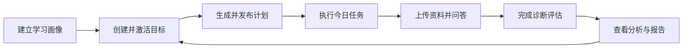

# 知序·自适应学习管理系统用户使用手册

> 适用版本：当前仓库实现  
> 架构同步日期：2026-07-22（独立 Python AI 服务与 Qdrant 主链路）  
> 适用对象：学生用户、系统管理员、演示与验收人员  
> 本文只描述当前代码已经提供的功能；需求文档中的后续扩展不当作已实现功能。

## 1. 系统能帮助你做什么

知序把个人学习过程组织成一条闭环：



系统不是一个让 AI 随意替你修改任务的聊天机器人。画像、状态转换、计划容量、发布事务、评分和统计由后端规则控制；你始终负责确认正式计划。

当前学习资料闭环只处理文档型内容。PDF、DOCX、Markdown、TXT 等资料可以被解析、切块、引用和统计；视频、音频和直播材料不进入问答证据、学习进度、掌握度或报告统计。

## 2. 访问地址与账号角色

### 2.1 常用地址

| 使用方式 | 前端地址 | 后端地址 | 接口文档 |
|---|---|---|---|
| 本地开发 | `http://localhost:5300` | `http://localhost:8080` | `http://localhost:8080/swagger-ui.html` |
| Docker Compose | `http://localhost:8088` | 由前端反向代理访问 | 默认不直接暴露 Swagger |

不要同时混用两个入口。例如，从 `5300` 登录后不要跳到 `8088` 继续操作，因为两个地址的浏览器本地登录状态相互独立。

### 2.2 公开宣传首页

访问前端根地址 `/` 会先进入公开宣传首页，不会强制跳转到登录页。页面提供：

- 产品能力切换：查看学习画像、Agent 规划、今日执行、知识库和学习复盘的界面预览；
- 学习闭环说明：了解“理解—规划—行动—反馈”的关系；
- 规划互动体验：选择学习方向、每周投入时间和指导方式，生成一份本地路径预览；
- 登录与注册入口：未登录时可以进入登录页或直接打开注册模式，已登录时可以返回工作台。

宣传页的规划结果只用于解释产品交互，由浏览器前端即时生成，不调用后端模型、不写入数据库，也不会替代登录后的正式画像和计划提案。登录页左上角和表单上方均可返回宣传首页。

### 2.3 角色

| 角色 | 可以做什么 |
|---|---|
| `STUDENT` 学生 | 管理自己的画像、目标、项目、计划、任务、知识库、问答、评估和分析 |
| `ADMIN` 管理员 | 查看运行状态，管理用户状态、学习目录、模型与提示词配置，查看审计日志 |

普通用户从登录页注册。管理员只有在首次初始化时配置了 `APP_ADMIN_PASSWORD` 才会创建；管理员页面不会向普通用户显示，直接访问也会被后端拒绝。

## 3. 第一次使用前的检查

### 3.1 本地运行

本地运行需要：

- JDK 21；项目编译目标为 Java 17，因此 JDK 21 可以运行；
- Maven 3.6.3 或更高版本；启动脚本会优先使用项目已准备的 Maven；
- MySQL 8，监听 `127.0.0.1:3306`；
- Redis 7 兼容服务，监听 `127.0.0.1:6379`，Windows 可使用 Memurai；
- Node.js 与 npm；
- 项目根目录中的 `.env`。

在项目根目录启动后端：

```powershell
cd C:\Users\Alan_king\Documents\LAgent
powershell -ExecutionPolicy Bypass -File .\scripts\start-backend-local.ps1
```

看到 Spring Boot 启动完成且没有数据库连接错误后，再打开第二个 PowerShell 启动前端：

```powershell
cd C:\Users\Alan_king\Documents\LAgent\frontend
npm install
npm run dev
```

浏览器打开 `http://localhost:5300`，首先看到公开宣传首页；需要直接登录时可访问 `http://localhost:5300/login`。

### 3.2 Docker 运行

```powershell
cd C:\Users\Alan_king\Documents\LAgent
docker compose up --build -d
docker compose ps
```

服务正常后打开 `http://localhost:8088`。首次构建需要下载镜像和依赖，等待时间会比后续启动长。

### 3.3 AI 画像与问答配置

知识库 AI 问答至少需要在 `.env` 中配置以下变量：

```dotenv
MODEL_ENABLED=true
MODEL_BASE_URL=https://api.deepseek.com
MODEL_API_KEY=你的真实密钥
MODEL_NAME=deepseek-v4-flash
AI_SERVICE_ENABLED=true
AI_SERVICE_BASE_URL=http://127.0.0.1:8090
AI_INTERNAL_TOKEN=请替换为独立的至少32字符随机令牌
```

本地运行需先启动 `scripts/start-ai-local.ps1`，再启动 `scripts/start-backend-local.ps1`。修改 `.env` 后必须重启这两个服务。模型密钥不要提交到 Git、不要复制到截图或日志中。

Redis 不可用时，登录和模型限流会降级为单进程内存计数；MySQL、任务和画像仍可以使用。DeepSeek 不可用时，画像访谈切换为规则引导，知识库问答降级为基于已检索资料的证据回答或明确拒答。

## 4. 推荐的完整使用顺序

第一次使用建议严格按以下顺序。可以先在宣传首页体验一次规划预览，但该预览不会保存，也不是正式学习计划：

1. 注册并登录；
2. 在“学习画像”通过 AI 访谈整理草稿，检查后确认并生成画像版本；
3. 在“目标与项目”创建目标并激活；
4. 在“Agent 计划”生成、校验、审阅和发布计划；
5. 在“今日执行”开始任务、计时、写笔记并完成任务；
6. 在“知识库”创建空间并上传文档；
7. 文档处理完成后，在“知识问答”选择空间并提问；
8. 在“评估与错题”完成诊断；
9. 在“学习分析”查看时长、完成率、掌握度和报告。

如果跳过画像、目标激活或计划发布，后续页面出现“无数据”通常是正常的业务结果，不是页面坏了。

## 5. 注册、登录与退出

### 5.1 注册

可以在宣传首页点击“开始构建路径”或“免费创建学习画像”直接进入注册模式，也可以在登录页切换到“创建学习账户”。注册时填写：

- 用户名：以后可以用它登录；
- 邮箱：也可以作为登录名；
- 邮箱验证码：点击“发送验证码”，填写邮件中的 6 位数字；
- 密码与确认密码：至少 8 个字符，请勿与其他网站重复使用。

验证码 10 分钟内有效，60 秒后可以重发，连续输错 5 次后需要重新获取。注册成功后系统直接签发登录令牌并进入学习画像。新用户默认角色是 `STUDENT`，默认时区是 `Asia/Shanghai`。

### 5.2 登录

“用户名或邮箱”一栏可以输入注册时的任意一种标识。登录成功后会自动跳转到原先想访问的页面，或进入 `/dashboard`。

连续 5 次密码错误会锁定 15 分钟。错误账号、错误密码和不可用账号统一显示“账号或密码错误”，这是为了避免泄露账号是否存在。

### 5.3 找回密码

在登录表单点击“忘记密码？”，填写注册邮箱并获取验证码，然后输入验证码和两遍新密码。页面对已注册和未注册的邮箱显示相同的发码提示，避免泄露账户信息。重置成功后返回登录表单；所有设备的刷新令牌会被撤销，需要使用新密码重新登录。

### 5.4 登录成功但没有跳转

按以下顺序排查：

1. 确认只打开了一个入口：本地用 `5300`，Docker 用 `8088`；
2. 按 `Ctrl+F5` 强制刷新；
3. 打开浏览器开发者工具的 Network，确认 `/api/v1/auth/login` 返回 `200`；
4. 如果返回 `401`，检查密码或锁定状态；
5. 如果接口成功但页面不跳转，清除该地址的 Local Storage 后重新登录；
6. 确认后端与前端都重启过，避免仍在使用旧代码。

当前登录页会显示后端返回的错误提示，不应出现点击后完全无反馈的情况。

### 5.5 更换邮箱与退出所有设备

账户设置中的邮箱变更需要先向新邮箱发送验证码，验证成功后才会保存。

在“账户设置”点击“全部退出”，系统会撤销该用户当前未过期的所有刷新令牌。操作后当前设备和其他设备都需要重新登录。

## 6. 学习总览

登录后的 `/dashboard` 学习总览用于快速判断“今天该做什么”，它与公开的 `/` 宣传首页是两个不同页面。学习总览主要显示：

- 最近 7 天的学习统计；
- 今日已发布任务；
- 当前活动目标；
- 前往今日执行、目标和计划页面的快捷入口。

总览不负责创建正式任务。只有计划版本成功发布后，任务才会出现在总览和今日执行中。

## 7. 学习画像

### 7.1 AI 对话式画像

“学习画像”页面默认显示左侧访谈和右侧结构化草稿。可以像聊天一样说明：

- 想学的方向和当前基础；
- 自定义开始、结束日期，或“从今天开始学 6 周”这样的周期；
- 每周能稳定学习的星期和时段；
- 喜欢的文档学习方式、讲解方式和专注时长；
- 可选的学习经历和当前困难。

AI 回复会随着模型生成逐段显示，而不是等待整段回答结束。流式生成期间可以点击“停止生成”；被取消或断开的半条回复不会保存。模型完整输出通过结构校验后，右侧才同步更新完成度、缺失项和字段依据。草稿完整后“确认并保存画像”才会启用；点击确认后，画像、偏好、每周时段和只读画像版本在一个事务中保存。模型超时或不可用时会进入规则引导模式，已经识别的信息不会丢失。

不要在访谈中输入密码、SMTP 授权码、API Key 或 Access Token。后端会在模型调用前拦截明显的密钥和提示注入文本。

#### 结构化约束

- 计划起止日期必须组成 1～365 天的周期，不再限制为固定 2/4/8 周；
- 必须且只能有一个主方向，目录中没有的方向可保存为自定义方向；
- 时区必须是 IANA 时区，例如 `Asia/Shanghai`；
- 背景说明最多 2000 字；
- 文档学习方式至少选择一种，目前只支持“文档阅读”和“练习测验”；专注时长 10～180 分钟，容量比例 60%～95%；
- 每周时段不能重叠，跨午夜会自动拆分，单日累计不超过 960 分钟。

需要精确修正时，点击右上角“高级手动编辑”。手动表单与对话流程使用相同校验，但不会偷偷覆盖尚未确认的访谈草稿。

确认后页面会显示：

- 画像版本号；
- 置信度；
- 推荐难度；
- 每日建议任务数；
- 风险与证据提示；
- 生成时间。

### 7.2 为什么画像版本增加了，但内容看起来没变化

这是当前实现的重要特性，不一定是故障。AI 参与的是“从对话提取画像草稿”；确认后的画像指标仍由确定性规则计算，不让模型编造诊断分数。当前规则主要是：

| 输入情况 | 置信度 | 推荐难度 | 每日建议任务 | 风险提示 |
|---|---:|---:|---:|---|
| 没有自评证据 | 10% | 1 | 2 | 尚无诊断或自评证据 |
| 至少一条自评证据 | 20% | 2 | 2 | 当前仅含自评证据，建议完成诊断 |

因此，只改背景文字、方向或时间后重新生成，版本号和生成时间会变化，但上述四个结果可能相同。要让当前规则的推荐结果发生明显变化，需要新增知识点自评证据后再生成。

当前前端画像向导还没有提供“知识点自评”输入控件。需要验证这条规则时，可在 Swagger 先通过 `GET /api/v1/knowledge-points?directionId=方向ID` 取得知识点内部 ID，再调用 `POST /api/v1/profiles/me/self-assessments`：

```json
{
  "knowledgePointId": 1,
  "level": 3,
  "lastStudiedAt": "2026-07-21",
  "note": "已学习基础内容，但实践不足"
}
```

保存自评后回到画像页再次生成，当前规则才会从“无自评”切换为“有自评”。这里的 `knowledgePointId` 必须使用目录接口返回的实际数字，不要照抄示例。

还要注意：完成“评估与错题”中的诊断会更新掌握度，但当前画像版本生成服务尚未把诊断掌握度读入快照，所以诊断完成后推荐值不会自动改变。这不代表访谈模型没有调用；可根据页面的“AI 正在参与结构化整理/规则引导模式”判断本轮访谈模式。

### 7.3 画像没有刷新时怎么做

1. 看页面版本号是否变为 `V2`、`V3`；
2. 强制刷新浏览器；
3. 确认后端接口 `/api/v1/profiles/me/versions` 返回了新版本；
4. 如果版本增加但数值相同，参照上一节判断是否只是规则输入没有跨过条件；
5. 如果版本不增加，查看生成请求是否报版本冲突，并刷新画像页面后重试。

## 8. 目标与项目

### 8.1 创建学习目标

目标用于描述想达到的学习结果。目标页提供两种入口：

- **自定义目标**：自己填写名称、描述、学习目录方向、目标类型、起止日期、优先级和每周预算。新用户即使还没有画像，也可以先创建 `DRAFT` 草稿；
- **基于画像推荐**：点击“让 AI 推荐”，系统读取当前已固化画像的方向、阶段、周期、学习偏好和每周容量，返回最多 3 个候选目标；如果画像里写的是“经济学”这类可识别的自定义方向，也会先自动映射到学习目录再推荐。点击“查看并采用”后仍会进入编辑确认框，确认保存前不会写入数据库。

AI 候选包含推荐理由、周期、每周投入、阶段成果和可验收的成功标准。模型或 Python 服务不可用时，页面仍会收到“规则建议”，不会把故障伪装成 AI 结果。推荐目标保存后会记录所依据的画像版本；以后更新画像不会自动篡改旧目标。画像、偏好或可用时间刚被修改但还没有生成新版本时，需要先回到画像页固化新版本。

系统内置的演示目录包含计算机方向和经济学方向。比如在画像访谈中说“想学经济学，零基础，希望一周学完”，系统会优先映射到目录方向“经济学”，后续目标推荐、计划拆解和诊断题都能使用对应知识点。如果画像方向是目录中没有的纯自定义文本，需要管理员先维护目录和知识点，或回到画像页选择已有目录方向。

自定义目标会附加默认验收条件“完成目标验收”；推荐目标使用候选中已经结构化的成功标准。自定义目标创建草稿不依赖画像，但激活、生成计划和 AI 推荐仍需要画像中的可用时间、容量偏好和方向信息。

新目标状态为 `DRAFT`，必须点击“激活”变为 `ACTIVE`，才能生成计划。

目标状态规则：

| 当前状态 | 可以执行的操作 |
|---|---|
| `DRAFT` | 激活、取消 |
| `ACTIVE` | 暂停、完成、取消 |
| `PAUSED` | 恢复、取消 |
| `COMPLETED` | 无后续转换 |
| `CANCELED` | 无后续转换 |

完成和取消需要填写原因，并写入审计日志。

### 8.2 创建实践项目

项目用于承载具体成果，例如“完成一个 Spring Boot 博客”。可填写名称、描述、方向、周期、优先级、仓库地址和成果物。

项目状态与目标相似，但已完成或已取消的项目还可以进入 `ARCHIVED` 归档状态。当前页面提供主要生命周期操作；更细的项目关联和里程碑接口可在 Swagger 中验证。

### 8.3 常见问题

- “Agent 计划”没有目标：目标仍是 `DRAFT` 或已经暂停/完成/取消；
- 无法生成推荐：画像尚未确认、画像周期已经结束、刚修改画像但尚未生成新版本，或画像方向仍是未映射到目录的纯自定义文本；
- 无法创建自定义目标：学习目录中没有任何 `ACTIVE` 方向，或选择了已停用方向；
- 激活失败：起止日期、版本或状态不合法；
- 完成后不能恢复：目标完成是终态，后端按状态机拒绝回退。

## 9. Agent 计划

### 9.1 当前 Agent 的真实边界

当前计划模块提供“Agent 式工作流”，即读取画像、目标与可用时间，生成结构化提案，再经过校验、审阅、确认和发布。计划拆解由后端 `RuleBasedPlanner` 的确定性规则完成，当前不调用 DeepSeek。

这意味着：

- 生成计划不会产生 DeepSeek 账单；
- “补充要求”作为规划上下文保存，但不等于模型自由理解所有自然语言要求；
- 所有任务仍受日期、时长和容量规则限制；
- 未发布提案不会创建正式任务。

### 9.2 生成提案

1. 选择一个 `ACTIVE` 目标；
2. 可填写补充要求；
3. 点击“生成计划提案”；
4. 系统返回独立计划版本和变更清单。

系统把任务控制在 10～120 分钟，并按每天可用时间乘容量比例计算可安排上限。默认系统容量系数为 85%，画像中的个人容量比例也参与计划上下文。

### 9.3 校验提案

点击“重新校验”后，主要检查：

- 变更动作是否合法；
- 标题是否为 2～200 字；
- 单任务是否为 10～120 分钟；
- 截止时间是否晚于开始时间；
- 任务是否在目标周期内；
- 同一天是否出现同名重复任务；
- 当天总负载是否超过允许容量。

存在 `ERROR` 时不能发布。

### 9.4 确认并发布

点击“确认并发布”会经历两次保护：

1. 页面弹窗让用户确认变更数量；
2. 后端签发有效期默认 30 分钟的确认令牌。

发布请求还携带幂等键，防止双击或网络重试生成重复任务。发布事务会同时应用任务、切换正式版本、保存发布记录、审计和 Outbox；任一步失败会整体回滚。

### 9.5 拒绝提案

点击“拒绝”只把提案标记为 `REJECTED`，不会改动现有正式计划和任务。

## 10. 今日执行

### 10.1 任务队列

选择日期后，左侧显示该日已发布任务，包括预计时长、排期状态、生命周期状态和优先级。没有任务时先检查是否已经发布计划，以及任务日期是否为所选日期。

任务生命周期与排期状态分开：例如截止时间已过的任务可以仍是 `NOT_STARTED`，同时计算为 `OVERDUE`。暂停学习也不会自动等于逾期。

### 10.2 学习计时

选择任务后可执行：

- 开始专注；
- 暂停；
- 继续；
- 结束记录。

服务端记录权威开始与结束时间。跨午夜会按用户时区分摊到两个学习日。点击“结束记录”后，学习时长才会进入统计。

### 10.3 学习笔记

可填写标题与 Markdown 正文。每次保存都会产生新的不可变历史版本，当前内容指向最新版本。前端渲染 Markdown 时会做 XSS 清理。

### 10.4 完成任务

点击“标记完成”后必须填写一句完成总结。后端校验任务状态；非法重复完成或不允许的转换会被拒绝。任务完成后，其历史计时、笔记和状态记录仍保留。

任务状态规则：

| 当前状态 | 允许进入 |
|---|---|
| `NOT_STARTED` | `IN_PROGRESS`、`BLOCKED`、`CANCELED` |
| `IN_PROGRESS` | `PAUSED`、`BLOCKED`、`COMPLETED`、`CANCELED` |
| `PAUSED` | `IN_PROGRESS`、`BLOCKED`、`COMPLETED`、`CANCELED` |
| `BLOCKED` | `IN_PROGRESS`、`CANCELED` |
| `COMPLETED` | `PAUSED`，用于受控完成反转 |
| `CANCELED` | 无 |

## 11. 个人知识库

### 11.1 创建知识空间

知识空间用于划分资料范围，例如“Java 后端课程”“毕业论文资料”。点击“新建空间”，填写名称后创建。问答时必须至少选择一个空间，避免检索范围含糊。

### 11.2 上传文档

支持 PDF、DOCX、Markdown 和 TXT，单次请求上限约 50 MB。视频、音频和普通 `.doc` 文件不会进入当前文档学习闭环。上传后会经历：

1. 文件名、扩展名、大小与内容安全检查；
2. 保存到不可执行的对象目录；
3. Apache Tika 提取文本；
4. 按目标约 600 字、最大 1600 字切块；
5. Java 把已保存的 Chunk 发送给 Python，使用 Sentence Transformers 生成 Dense Embedding；
6. 以 `STAGING` 状态批量写入 Qdrant，完整成功后原子切换为 `ACTIVE`；
7. Java 把文档标记为可检索状态。

Embedding 模型在 Python 服务本地运行，不调用付费 Embedding API，所以仅上传文档不会产生对话模型费用。首次使用可能需要下载模型权重；网络或模型不可用且显式允许降级时，系统改用 `LOCAL_HASHED_384` 并在 AI 健康状态中标明 `degraded=true`。旧 Java 128 维哈希向量仅用于迁移回滚。

扫描版 PDF 如果没有可提取文字，当前版本没有 OCR，可能处理失败。建议先把扫描件转成可搜索 PDF。

### 11.3 文档状态

上传后状态会从处理中进入已索引/可用状态；失败时可调用重试接口。只有处理完成的活动版本才参与检索。

### 11.4 删除文档

删除是高影响操作，需要先请求短时删除令牌，再确认删除。确认后文档会立即退出可检索范围，并更新为清除状态。当前页面已经封装这两步操作。

## 12. 知识问答

### 12.1 发起问答

1. 先在左侧勾选一个或多个知识空间；
2. 点击“新对话”，或打开历史对话；
3. 输入问题；
4. 点击发送或按 `Ctrl+Enter`；
5. 查看回答下方的引用片段；
6. 可点击“有帮助”或“需改进”。

### 12.2 是否真的调用 DeepSeek

满足以下条件时，问答会真正调用 OpenAI Chat Completions 兼容接口：

- `MODEL_ENABLED=true`；
- `MODEL_BASE_URL`、`MODEL_API_KEY`、`MODEL_NAME` 有效；
- `AI_SERVICE_ENABLED=true`，Python 8090 健康且 Java/Python 的 `AI_INTERNAL_TOKEN` 一致；
- 后端已经重启并读取新配置；
- 所选空间存在已索引文档；
- Qdrant 中存在当前用户授权范围内的活动索引，融合分达到当前证据阈值；
- 用户没有触发模型请求限流。

Python 默认先做 Dense Top 20，再按 `0.85 × 向量归一化分 + 0.15 × 关键词覆盖分` 重排并取前 5。Java 会按 Chunk ID 再次鉴权；模型只能使用验证后的片段回答，伪造引用会触发资料片段降级。页面会逐字显示答案，只有 `message.completed` 后才能反馈。

每次模型调用会在 `model_run` 表记录用途、模型名、成功/失败状态、输入/输出 Token、延迟和哈希，但不会保存 API Key。可用下面的查询确认是否真实调用：

```sql
SELECT id, purpose, model_name, status,
       input_tokens, output_tokens, latency_ms, created_at
FROM model_run
ORDER BY created_at DESC
LIMIT 20;
```

如果记录为 `SUCCESS` 且有 Token 数，说明供应商请求已经成功。供应商控制台“费用暂时没变化”可能来自免费额度、计费延迟或 Token 很少，不能仅凭余额判断是否调用。

### 12.3 为什么有时不扣费

- 问题没有足够资料证据，系统在调用模型前就拒答；
- 配置没被后端读取，系统走降级回答；
- 模型供应商返回失败或超时；
- 触发每用户每分钟 20 次的默认模型限流；
- 使用了供应商免费额度或控制台账单延迟；
- 你操作的是画像版本指标或计划生成；画像只有“对话采集”阶段调用模型，版本指标和计划排期仍使用确定性规则。

### 12.4 引用与拒答

有证据的回答会显示 `[S1]` 一类引用。没有足够证据时，系统明确提示资料不足，不使用模型常识补写私有资料中没有的结论。这是安全设计，不是故障。

## 13. 评估、错题与掌握度

### 13.1 创建诊断

选择学习方向和难度后点击“开始诊断”。系统从该方向的公共已发布题库中，按所选难度上下浮动一级抽题。题目数量大致按诊断时长除以 3 计算。

当前诊断题来自数据库公共题库，不由 AI 临时生成。如果提示“该方向暂无可用诊断题”，需要管理员为该方向维护公共题目。

### 13.2 答题与交卷

答案在选择或失焦时实时保存。交卷请求带幂等键，多次点击不会重复评分。客观题由规则比对标准答案；非客观题当前进入待复核状态，不作为已完成的 AI 正式评分。

### 13.3 错题本

客观题答错后写入错题记录，累计错误次数并保存最近错误时间。错题记录不会因为题库后来修改而无痕变化，评估使用题目版本快照。

### 13.4 掌握度与置信度

掌握度是 0～100 的分数，置信度表示“系统对这个分数有多确定”。当前证据分量包括：

- `Q`：题目与评估；
- `R`：复习；
- `P`：项目实践；
- `S`：用户自评。

存在的证据分量会重新归一化，不会因为缺少某类证据直接把分数压低。证据按约 30 天半衰期衰减。等级大致为：低于 40 未掌握，40～59 薄弱，60～79 基础，80 以上熟练；置信度低于 0.4 时增加“暂定”含义。

只有自评时置信度最多 0.2，因此自评分很高也只表示“建议补测”，不是系统已经确认掌握。

## 14. 学习分析

可以选择日期范围，查看：

- 有效学习时长；
- 任务完成率；
- 按时完成率；
- 逾期率；
- 每日自动计时与手工补录；
- 知识点掌握度与置信度；
- 已生成的学习报告及修订号；点击“查看”可打开报告正文、生成时冻结的指标快照和掌握度证据。

所有比率由后端统一计算，同时保留分子、分母、时区、刷新时间和算法版本。所选周期没有任务时，完成率会显示“不适用”，而不是错误地显示 0%。

同一周期重复生成报告会增加修订号，不会覆盖历史报告。生成成功后系统会自动打开本次报告；也可以在历史列表中点击“查看”重新打开任一修订版。

## 15. 账户设置与通知

可以修改邮箱和 IANA 时区。用户名不可修改。时区修改会影响之后的任务归属日、跨日学习时长和统计范围。

通知偏好包括任务即将到期、任务逾期、报告完成和文档处理完成。安全类通知不能关闭。相同业务事件使用去重键，避免重复提醒。

保存时发生“版本冲突”通常说明数据已经在另一页面或设备更新；刷新页面后重试即可。

## 16. 管理员使用说明

### 16.1 运行监控

管理员页面展示用户总数、运行中/失败作业、模型配置数和系统指标。更详细的健康状态可查看 `/actuator/health`，生产环境应限制访问范围。

### 16.2 用户状态

管理员可以禁用或启用用户，操作时必须填写原因并携带当前版本。状态变更会写审计日志。被禁用用户不能继续正常登录。

### 16.3 学习方向与知识点

管理员可查看方向和知识点，并从页面新增学习方向。更完整的知识点、依赖和目录维护接口在 Swagger 的 `/api/v1/admin` 分组中。

### 16.4 模型与提示词

页面可查看数据库中的模型与提示词配置。当前知识问答的实际供应商连接以运行环境中的 `MODEL_*` 为准；仅在管理页面新增一条数据库模型配置，不会自动替换运行中的环境变量客户端。

### 16.5 审计日志

可以查看时间、操作、资源类型、公开标识和结果。审计记录用于解释“谁在什么时候对什么资源做了什么”，不应存储明文密码、令牌或模型密钥。

## 17. 常见故障速查

| 现象 | 常见原因 | 处理方式 |
|---|---|---|
| 登录无反应 | 前后端版本不一致或浏览器旧缓存 | 重启前后端，`Ctrl+F5`，检查登录接口 |
| 登录后仍回登录页 | 混用了 `5300` 和 `8088` | 固定使用一个入口并重新登录 |
| 前端 `5173 EACCES` | 系统端口受限，而旧配置仍使用 5173 | 使用当前配置的 `5300`，重启 `npm run dev` |
| 后端数据库连接失败 | MySQL 未监听 3306、账号或密码错误 | 检查 MySQL 服务和 `.env` 的数据库配置 |
| Redis 连接失败 | Redis/Memurai 未启动 | 启动 6379；核心业务可先用降级模式 |
| 画像对话没有逐字输出或草稿不变 | Python/模型未启用、内部令牌不一致、模型输出被规则拒绝，或尚未点击确认画像 | 检查 Python 8090 健康状态和 `AI_SERVICE_*`，完成访谈后确认画像；失败时页面会显示规则降级提示 |
| 没有可规划目标 | 目标未激活 | 在目标页把 `DRAFT` 激活为 `ACTIVE` |
| 发布按钮不可用 | 校验未通过或提案状态不允许 | 重新校验并处理所有错误 |
| 今日没有任务 | 计划未发布或日期不匹配 | 确认计划状态为 `PUBLISHED` 并选择正确日期 |
| 文档一直不可问答 | 文档未完成索引或无可提取文本 | 查看文档状态，失败时重试或更换文件 |
| 问答不扣费 | 证据不足、模型降级或免费额度 | 查询 `model_run` 表确认真实调用 |
| 诊断没有题 | 该方向没有公共已发布题目 | 管理员补充题库或换有题目的方向 |
| 保存提示版本冲突 | 页面数据已过期 | 刷新后再编辑，避免覆盖新版本 |
| 接口返回 401 | Access Token 过期且刷新失败 | 重新登录 |
| 接口返回 403 | 当前角色没有权限 | 使用正确角色，不要绕过权限控制 |

## 18. 验收演示建议

为了在答辩或验收时完整展示业务闭环，建议提前准备：

- 一个普通学生账号和一个管理员账号；
- 一个已建立画像、但还没有发布计划的新目标；
- 一份包含明确概念和出处的 Markdown/PDF 资料；
- 一个有公共题目的学习方向；
- DeepSeek 密钥与足够额度；
- `model_run` 查询窗口，用于证明知识问答确实调用模型。

演示顺序建议为“生成画像版本 → 激活目标 → 生成/校验/发布计划 → 今日计时与笔记 → 上传资料 → 有证据问答和无证据拒答 → 诊断交卷 → 分析报告 → 管理员审计”。

如需展示完整产品入口，可在上述业务演示前增加：“打开公开宣传首页 → 切换五项产品能力 → 设置方向、每周时间与指导方式并生成路径预览 → 点击注册入口”。需要向评审明确：宣传页路径预览是无持久化的交互说明，正式画像与计划仍需登录后按业务流程生成和确认。
